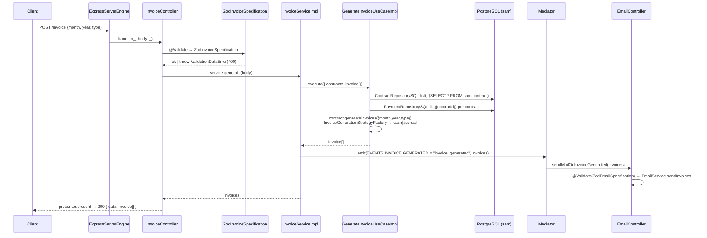

# Architecture

> **Tax Invoice Issuer** — modular monolith, ports & adapters flavor: every external concern (HTTP server, database, mail, PDF, validation) sits behind an interface ("port") with a swappable implementation ("adapter" / "engine"), wired by Inversify DI. Verified against source on 2026-09-02.

**Stack:** TypeScript 5.9 · Express 5 · Inversify 7 · pg-promise 12 · Zod 4.3 · nodemailer 7 · puppeteer 24 · moment 2 · Jest 29

---

## Module map

```text
src/
├── server.ts                  # entry: builds container, gets App, app.start()
├── app.ts                     # App facade: setup() → controllers setup, start() → listen
├── main.ts                    # legacy duplicate entry (not used — server.ts is the real one)
├── engine/                    # legacy duplicate (server.engine.ts) — not wired
├── @decorators/               # AOP decorators (reflect-metadata)
│   ├── log/data.decorator.ts  #   @DataLogger @InputLogger @OutputLogger
│   ├── error/handler.decorator.ts  # @ErrorHandler → statusError fail-fast
│   ├── validation/validation.decorator.ts  # @Validate('prop') → Specification
│   └── async/logger.decorator.ts
├── @lib/                      # log.lib.ts, errors (AppError, SecretError, DatabaseError, Validation*)
├── @types/                    # ambient types: http methods, cors, zod, strategy, events, env, mediator
├── @utils/                    # module/load.util.ts (compose Containers), decorator/metadata.util.ts
└── @modules/
    ├── app.module.ts          # APP_MODULE = loads([...INFRA_MODULE, ...APPLICATION_MODULE])
    ├── app.registry.ts        # MODULE  → typed DI tokens (the "Registry")
    ├── app.factory.ts         # MODULES → factory accessors per module
    ├── domain/                # PURE business core (no framework imports)
    │   ├── entity/            #   Contract (payments, getBalance, getAmountByPeriod, generateInvoices),
    │   │                      #   Payment, Invoice
    │   ├── strategy/invoice/  #   InvoiceGenerationStrategy + CashBasisStrategy / AccrualBasisStrategy
    │   │                      #   + InvoiceGenerationStrategyFactory (static factory)
    │   ├── use-case/          #   GenerateInvoiceUseCase (contract → invoices),
    │   │                      #   SendInvoiceEmailUseCase, ListContractsUseCase
    │   ├── service/           #   InvoiceService, EmailService (interfaces)
    │   ├── repository/        #   ContractRepository, PaymentRepository (interfaces)
    │   ├── specification/     #   Specification<T> interface (validation port)
    │   ├── validator/         #   Validator interface
    │   └── DTO/               #   InvoiceDTO {month, year, type}, GenerateInvoiceDTO, ...
    ├── application/           # implementations of domain ports
    │   ├── controller/        #   InvoiceController (HTTP), EmailController (event-driven)
    │   ├── service/           #   InvoiceServiceImpl (orchestrates + emits event),
    │   │                      #   EmailServiceImpl
    │   ├── use-case/          #   *Impl: generate-invoice, list-contracts, send-invoice
    │   └── repository/sql/    #   ContractRepositorySQL, PaymentRepositorySQL (read-only)
    └── infra/                 # adapters & engines
        ├── server/http/express/       # ExpressServerEngine implements HttpServer
        ├── engine/database/sql/postgres/  # PgPromiseEngine
        ├── engine/mail/nodemailer/    # nodemailer SMTP adapter
        ├── engine/document/pdf/puppeteer/ # PDF/screenshot adapter (email route 'pdf')
        ├── mediator/          # NodejsEventEmitterMediator (Observer/Mediator)
        ├── presenter/         # ExpressJsonPresenter → { data: result }
        ├── router/            # EmailRouter (smtp/pdf/http engines) + validator
        ├── validator/zod/     # ZodInvoiceSpecification, ZodEmailSpecification, adapter
        ├── sanitizer/         # input sanitization helper
        └── config/            # env.config.ts (requiredSecret guard) + events.config.ts
```

## Dependency-injection anatomy (3 artifacts per module)

| Artifact     | File pattern    | Role                                                                                                                                  |
| ------------ | --------------- | ------------------------------------------------------------------------------------------------------------------------------------- |
| **Registry** | `*.registry.ts` | Tree of unique string tokens, e.g. `MODULE.APPLICATION.SERVICE.INVOICE = "MODULE::APPLICATION::SERVICE::INVOICE"`                     |
| **Factory**  | `*.factory.ts`  | Accessor resolving a token from the container: `INVOICE: () => MODULES.INFRA.get<InvoiceService>(MODULE.APPLICATION.SERVICE.INVOICE)` |
| **Module**   | `*.module.ts`   | `new Container(...)` binding tokens to implementations (`to(...).inSingletonScope()` style)                                           |

Composition root: `server.ts` → `AppModule` (`loads([...INFRA_MODULE, ...APPLICATION_MODULE])`) → `container.get(MODULE.APP)` → `app.setup(); app.start();`.

## Request lifecycle — `POST /invoice`



Notes:

- `@ErrorHandler` wraps the controller method: errors become `statusError` `{status: 400|500}` responses via the presenter.
- **EmailController is event-driven**, not HTTP: it subscribes to `EVENTS.INVOICE.GENERATED` at `setup()`.
- Repositories are **read-only** (list operations); invoices are **computed, never persisted**.
- `Contract.generateInvoices()` delegates to a **static factory + strategy** (classic GoF teaching example):
  - `CashBasisStrategy` — an invoice per _payment received_ in the target month/year.
  - `AccrualBasisStrategy` — one invoice per elapsed period (`amount / periods`) _before_ the target month, date arithmetic in UTC via `moment`.

## Design patterns (verified enumeration)

| #   | Pattern                 | Evidence (file)                                                         | Intent here                                    |
| --- | ----------------------- | ----------------------------------------------------------------------- | ---------------------------------------------- |
| 1   | Dependency Injection    | all `*.module.ts` (Inversify)                                           | constructor injection via `@inject(MODULE...)` |
| 2   | Registry                | `src/@modules/**/ *.registry.ts`                                        | typed, greppable DI tokens                     |
| 3   | Abstract Factory        | `src/@modules/**/factory/*.factory.ts`                                  | per-module object families                     |
| 4   | Strategy                | `domain/strategy/invoice/type/*.ts`                                     | cash vs accrual generation                     |
| 5   | Factory Method (static) | `invoice.strategy.ts` → `InvoiceGenerationStrategyFactory.create(type)` | selects strategy at runtime                    |
| 6   | Repository              | `application/repository/sql/*.ts`                                       | SQL isolation behind domain interfaces         |
| 7   | Decorator (AOP)         | `src/@decorators/**`                                                    | logging, validation, error handling cross-cuts |
| 8   | Adapter                 | `infra/engine/**` (express, pgpromise, nodemailer, puppeteer)           | wrap 3rd-party libs behind ports               |
| 9   | Observer / Mediator     | `infra/mediator/*` + `config/event/events.config.ts`                    | decouple invoice generation from email         |
| 10  | Facade                  | `AppFactory`, `EmailRouter`                                             | simple entry over composed internals           |

> **Doc reconciliation:** older documents claimed "7" (README legacy) or "8" (old PT analysis) patterns — both were written before the mediator/email layer matured. The verified current state is **10**.

## Known quirks & technical notes

| Area                         | Observation                                                                                         | Impact                                                                        |
| ---------------------------- | --------------------------------------------------------------------------------------------------- | ----------------------------------------------------------------------------- |
| `express.server.ts`          | `on()` re-registers **all** previously registered routes on every call (`this.routes.forEach(...)`) | Harmless with 2 routes; O(n²) registrations; fix: register once in `listen()` |
| Repositories                 | `parseFloat(c.amount)` — pg returns `numeric` as string                                             | correct handling worth knowing                                                |
| Repositories                 | read-only; no INSERT APIs                                                                           | DB seeds come only from `migration/create.sql`                                |
| Invoices                     | computed on the fly, never stored                                                                   | no invoice table — fine for the teaching scope                                |
| `moment`                     | used in `AccrualBasisStrategy` (UTC)                                                                | legacy lib; consider `Temporal`/date-fns later                                |
| Zod 4 idiom                  | `z.coerce.date()`, `.issues`, safeParse-style via `toValidate()`                                    | project genuinely uses Zod 4 APIs                                             |
| `src/engine/`, `src/main.ts` | legacy duplicates of the server bootstrap                                                           | dead code — candidates for cleanup                                            |
| Swagger                      | `swagger-autogen` → `docs/swagger.json` with empty `paths`; UI mount redirects                      | see [SECURITY.md](SECURITY.md#technical-debt)                                 |

## Error taxonomy

`src/@lib/error/`: `AppError` (base) → `SecretError` (missing env, startup fail-fast), `DatabaseError`, `ValidationDataError` / `NoDataError` (HTTP 400 with zod `.issues` attached as `cause`). Controllers convert to `statusError` via `@ErrorHandler`; unknown errors degrade to 500.

---

**Next reads:** [API-REFERENCE.md](API-REFERENCE.md) · [DATA-MODEL.md](DATA-MODEL.md) · [TESTING.md](TESTING.md) · [SECURITY.md](SECURITY.md) · [← Index](../INDEX.md)
