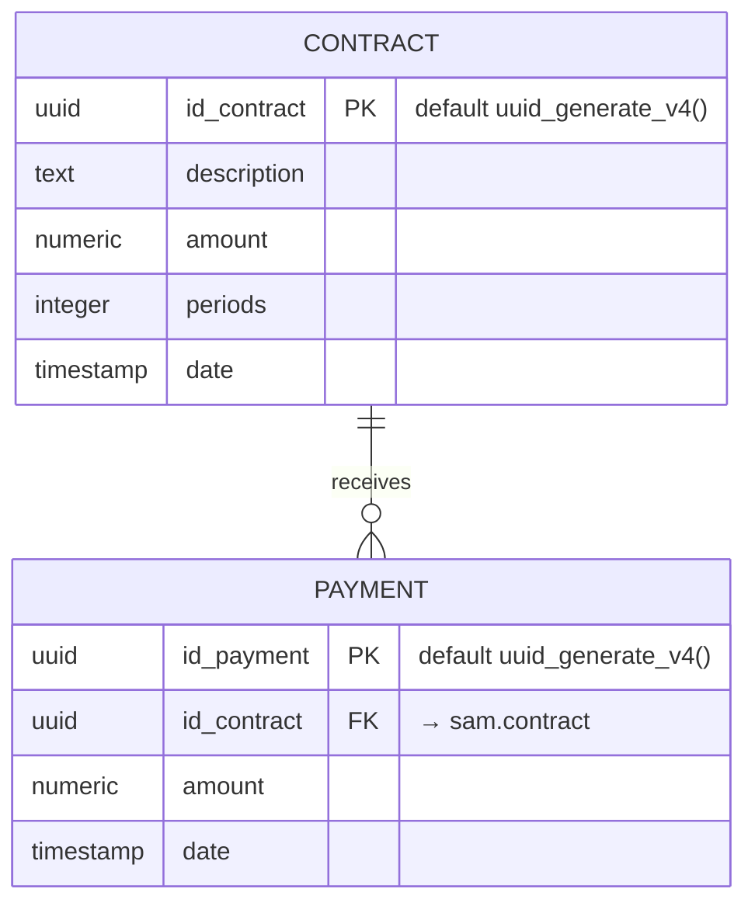

# Data Model

> Source of truth: `migration/create.sql`, `migration/versions/001_initial_schema.sql`, `migration/runner.sh`, and the repositories in `src/@modules/application/repository/sql/`.

## Entity-relationship



Schema: **`sam`** (PostgreSQL schema, not the default `public`). Extension: `uuid-ossp`.

**Entity ↔ DB mapping notes**

- There is **no `invoice` table** — invoices are computed in memory (see [ARCHITECTURE.md](ARCHITECTURE.md)) and never persisted.
- `numeric` columns arrive from pg-promise as **strings**; repositories convert with `parseFloat(...)`.
- `Contract.payments` is populated in code by joining `PaymentRepositorySQL.list({ contrarId })` — not a SQL JOIN.

## Migrations

| File                                        | Behavior                                                                                                                                                    |
| ------------------------------------------- | ----------------------------------------------------------------------------------------------------------------------------------------------------------- |
| `migration/create.sql`                      | **DESTRUCTIVE bootstrap**: `drop schema if exists sam cascade;` → creates extension, schema, both tables → inserts a fixture (1 contract + 1 payment, 2022) |
| `migration/versions/001_initial_schema.sql` | Idempotent variant (`CREATE ... IF NOT EXISTS`, no seed, no drop) — **not executed** by the runner; kept as reference                                       |
| `migration/runner.sh`                       | POSIX sh runner: requires `DATABASE_URL`, runs `psql --single-transaction --set=ON_ERROR_STOP=1 -f create.sql`                                              |
| `Dockerfile.migrations`                     | One-shot compose service that runs the runner                                                                                                               |

Git history of `migration/`: create database `sam` → add `payment` table → seed data → safe-deletion note → versioned runner + `Dockerfile.migrations` → **runner executes `create.sql`** (destructive path is the current one).

> ⚠️ **Every deployment re-creates the `sam` schema** and re-seeds. This is intentional for the study project / Azure demo flow. Never point `DATABASE_URL` at data you want to keep.

### Seeded fixture

```text
contract: 4224a279-c162-4283-86f5-1095f559b08c | "Prestação de serviços escolares" | 6000 | 12 periods | 2022-01-01
payment:  c931d9db-c8d8-44d4-8861-b3d6b734c64e | contract 4224a279… | 6000 | 2022-01-05
```

→ `POST /invoice {"month":1,"year":2022,"type":"cash"}` returns 1 invoice of 6000 (from the payment); `"type":"accrual","month":2` returns 1 invoice of 500 (period value).

## Repositories (read-only)

| Class                   | Method                                    | SQL                                                                |
| ----------------------- | ----------------------------------------- | ------------------------------------------------------------------ |
| `ContractRepositorySQL` | `list(): Promise<Contract[]>`             | `SELECT * FROM sam.contract`                                       |
| `PaymentRepositorySQL`  | `list({ contrarId }): Promise<Payment[]>` | `SELECT * FROM sam.payment WHERE id_contract = $1` — parameterized |

Both are `@injectable()`, receive the `SQLDatabaseConnection` (pg-promise adapter) via `MODULE.INFRA.ENGINE.DATABASE.SQL.POSTGRES.PGPROMISE`, and map rows to domain entities.

## Connection & configuration

- Driver: **pg-promise** (`PgPromiseEngine`), singleton from the Inversify container.
- URL: `DATABASE_URL` env var, resolved through `requiredSecret()` (`infra/config/env/env.config.ts`) → throws `SecretError` at startup if absent.
- Compose: the `postgres` service (image per `POSTGRES_IMAGE`, default port `5432`, user `postgres`, password from `POSTGRES_PASSWORD`); app in compose must target host `postgres`, local dev targets `localhost`.

## Ruled out

| Item                | Reality                                                                                           |
| ------------------- | ------------------------------------------------------------------------------------------------- |
| Prisma              | `package.json` dependency + dead `db:sync` script; **no schema, no client, zero code references** |
| Query builder / ORM | none — raw parameterized SQL by design (teaching goal)                                            |
| Invoice persistence | not implemented (compute-and-email flow)                                                          |

---

[← Architecture](ARCHITECTURE.md) · [API](API-REFERENCE.md) · [Docs Index](../INDEX.md)
