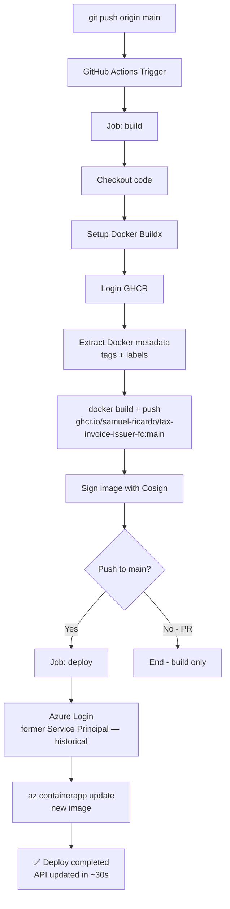

# 🏗️ Azure Architecture — Tax Invoice Issuer FC

> Technical decisions, diagrams, and rationale for the Azure Cloud deployment.
>
> **Status: Historical — not the current deployment source.** This document
> preserves the design, names, and credential flow of a previous
> configuration. For the confirmed topology, use the [current manual runbook](./manual/step-by-step-guide.md),
> which documents `-learn`, Azure OIDC, the separate VNets, bidirectional
> peering, and the PostgreSQL-specific private DNS zone.

---

## 📐 Architecture Diagram

```
┌──────────────────────────────────────────────────────────────────┐
│                        DEVELOPER WORKFLOW                        │
│                                                                  │
│   git push origin main                                           │
│         │                                                        │
│         ▼                                                        │
│   ┌─────────────────────────────────────────┐                   │
│   │           GitHub Actions CI/CD          │                   │
│   │                                         │                   │
│   │  ① Checkout → ② npm test               │                   │
│   │  ③ docker build                        │                   │
│   │  ④ Push → ghcr.io/samuel-ricardo/...   │                   │
│   │  ⑤ az containerapp update             │                   │
│   └─────────────────────────────────────────┘                   │
└──────────────────────────────────────────────────────────────────┘
                              │
                              │ Deploy image
                              ▼
┌──────────────────────────────────────────────────────────────────┐
│              AZURE CLOUD — Resource Group: rg-tax-invoice-fc     │
│                          Region: East US                         │
│                                                                  │
│  ┌─────────────────────────────────────────────────────────┐    │
│  │         Container Apps Environment (cae-tax-invoice-fc)  │    │
│  │                                                          │    │
│  │  ┌──────────────────────────────────────────────────┐   │    │
│  │  │   Container App: ca-tax-invoice-fc-api            │   │    │
│  │  │                                                   │   │    │
│  │  │   Image: ghcr.io/samuel-ricardo/...               │   │    │
│  │  │   CPU: 0.25 vCPU  |  Memory: 0.5 GiB             │   │    │
│  │  │   Scale: 0 → 1 replicas (HTTP trigger)            │   │    │
│  │  │   Port: 3000                                      │   │    │
│  │  │   Ingress: External HTTPS                         │   │    │
│  │  │                                                   │   │    │
│  │  │   ENV: DATABASE_URL (secret)                      │   │    │
│  │  │        NODE_ENV=production                        │   │    │
│  │  └──────────────────┬───────────────────────────────┘   │    │
│  │                     │ Port 5432 (internal)               │    │
│  └─────────────────────┼───────────────────────────────────┘    │
│                         │                                        │
│  ┌──────────────────────▼───────────────────────────────────┐   │
│  │   PostgreSQL Flexible Server: psql-tax-invoice-fc        │   │
│  │                                                          │   │
│  │   SKU: Standard_B1ms (1 vCPU, 2 GiB RAM)                │   │
│  │   Version: PostgreSQL 15                                 │   │
│  │   Storage: 32 GiB                                        │   │
│  │   Backup: 7 days  |  HA: Disabled                       │   │
│  │   SSL: Required                                          │   │
│  │                                                          │   │
│  │   ⚡ Stop/Start: pausa quando não usar                   │   │
│  └──────────────────────────────────────────────────────────┘   │
│                                                                  │
│  ┌──────────────────────────────────────────────────────────┐   │
│  │   Log Analytics Workspace: law-tax-invoice-fc            │   │
│  │   Retenção: 30 dias  |  Free: 5GB/day ingestion          │   │
│  └──────────────────────────────────────────────────────────┘   │
└──────────────────────────────────────────────────────────────────┘
                              │
                              │ HTTPS
                              ▼
                    ┌─────────────────┐
                    │    🌍 Internet   │
                    │  (Recruiters,   │
                    │   Portfolio)    │
                    └─────────────────┘
```

---

## 🔄 Detailed CI/CD Flow



---

## 🧱 Azure Resources — Details

### 1. Azure Container Apps Environment

**Resource**: `Microsoft.App/managedEnvironments`
**Name**: `cae-tax-invoice-fc`

The environment is the shared execution context for Container Apps. This project has only 1 app, but the environment can scale to multiple services.

**Log Analytics integration**: all container logs are sent automatically.

---

### 2. Container App (API)

**Resource**: `Microsoft.App/containerApps`
**Name**: `ca-tax-invoice-fc-api`

| Setting       | Value                    | Reason                                        |
| ------------- | ------------------------ | --------------------------------------------- |
| CPU           | 0.25 vCPU                | Minimum supported — portfolio has low traffic |
| Memory        | 0.5 GiB                  | Sufficient for Node.js Express                |
| Min replicas  | **0**                    | Scale-to-zero = $0 cost when idle             |
| Max replicas  | 1                        | 1 instance is enough for a portfolio          |
| Scale trigger | HTTP (10 req concurrent) | Scales up when traffic arrives                |
| Ingress       | External + HTTPS         | Public URL with automatic TLS                 |

**Public URL**: `https://ca-tax-invoice-fc-api.<random>.eastus.azurecontainerapps.io`

#### Secrets Management

The PostgreSQL connection string is stored as a **Container Apps Secret** (built-in, encrypted, no additional cost). It never appears in logs or visible environment variables.

```
Secret name: database-url
Value: <DATABASE_URL_FROM_KEY_VAULT>
Referenced as env var: DATABASE_URL
```

---

### 3. PostgreSQL Flexible Server

**Resource**: `Microsoft.DBforPostgreSQL/flexibleServers`
**Name**: `psql-tax-invoice-fc`

| Setting              | Value         | Reason                                    |
| -------------------- | ------------- | ----------------------------------------- |
| SKU                  | Standard_B1ms | Smallest tier available (1 vCPU, 2 GiB)   |
| Tier                 | Burstable     | CPU burst when needed, cheap when idle    |
| Version              | PostgreSQL 15 | Stable LTS                                |
| Storage              | 32 GiB        | Reasonable minimum                        |
| HA                   | Disabled      | Portfolio does not need high availability |
| Geo-redundant backup | Disabled      | Cost savings                              |
| SSL                  | Required      | Mandatory security                        |

**Firewall**: the `AllowAllAzureIPs` rule (0.0.0.0 → 0.0.0.0) allows Container Apps to access the database. It does not expose it to the public internet (internal Azure IPs only).

---

### 4. Log Analytics Workspace

**Resource**: `Microsoft.OperationalInsights/workspaces`
**Name**: `law-tax-invoice-fc`

Collects logs from all containers automatically. Enables queries via the Azure Portal for debugging.

```kusto
// Ver logs da API
ContainerAppConsoleLogs_CL
| where ContainerAppName_s == "ca-tax-invoice-fc-api"
| project TimeGenerated, Log_s
| order by TimeGenerated desc
| take 50
```

---

## 🔐 Security Decisions (ADR)

### ADR-001: GitHub Container Registry vs Azure Container Registry

**Decision**: Use `ghcr.io` (GHCR)
**Reason**: Free for public repositories, with native GitHub Actions integration via `GITHUB_TOKEN` and no additional secrets. ACR Basic costs ~$5/month — unnecessary for a portfolio.

### ADR-002: Scale-to-Zero for the API

**Decision**: `minReplicas: 0`
**Reason**: The portfolio has occasional traffic (recruiters, demos). With scale-to-zero, the idle cost is $0. A 3-8s cold start is acceptable in this context.

### ADR-003: PostgreSQL B1ms vs Azure Free (no free option)

**Decision**: Use B1ms with Stop/Start
**Reason**: There is no permanent free tier for PostgreSQL on Azure. B1ms at $12.41/month is the smallest SKU. With manual Stop/Start, you pay only for storage (~$0.37/month) when stopped.

### ADR-004: Bicep vs Terraform vs ARM

**Decision**: Azure Bicep
**Reason**: Azure-native (no external dependencies), cleaner syntax than ARM JSON, Microsoft-first. For an Azure portfolio, Bicep demonstrates more seniority than Terraform in Azure-only contexts.

---

## 🌐 Connectivity

```
Internet → Azure Front Door (built-in no Container Apps) → Container App → PostgreSQL
                                                                               (internal only)
```

- The Container App exposes port 3000 via HTTPS (443) with automatic TLS
- PostgreSQL has **no** external ingress — it is accessible only within Azure
- The Container App → PostgreSQL connection uses mandatory SSL (`sslmode=require`)

_Translated to English — documentation consolidation, 2026-09._
