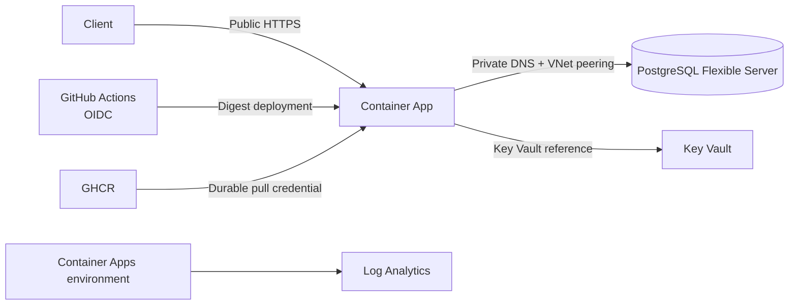

# Azure deployment

> **Current source of truth — current as of 2026-08-25**
>
> Use the [manual Azure runbook](./manual/step-by-step-guide.md) for the complete
> current procedure. This page is the concise map of the deployed topology,
> workflow, migration behavior, and verification boundaries. It does not replace
> the runbook and contains no secret values.

For historical incident context, see the [Azure deployment saga](./history/DEPLOYMENT-SAGA.md).
That record is not a current runbook and does not override this page or the
[manual runbook](./manual/step-by-step-guide.md).

## Current learning target

| Resource                   | Current value                                  |
| -------------------------- | ---------------------------------------------- |
| Repository                 | `Samuel-Ricardo/Tax-Invoice-Issuer-FC`         |
| Region                     | Brazil South                                   |
| Resource group             | `rg-tax-invoice-fc-learn`                      |
| Container Apps environment | `env-tax-invoice-fc-learn`                     |
| Container App              | `app-tax-invoice-fc-learn`                     |
| PostgreSQL Flexible Server | `psql-tax-invoice-fc-learn`                    |
| Key Vault                  | `kv-tax-invoice-fc-learn`                      |
| Log Analytics              | `law-tax-invoice-fc-learn`                     |
| GHCR image repository      | `ghcr.io/samuel-ricardo/tax-invoice-issuer-fc` |

The app uses external HTTPS ingress on port `443` and routes to target port
`3000`. Copy the dynamic Application Url from the Container App **Overview**
page before testing. Use `<POSTMAN_BASE_URL>` in notes; do not append `:3000`.

## Current topology

The Container Apps environment uses application VNet `vnet-tax-invoice-fc`,
subnet `default`. PostgreSQL uses database VNet
`rg-tax-invoice-fc-learn-vnet`, subnet `default`. The VNets communicate through
bidirectional peerings `peer-to-db-vnet` and `peer-to-app-vnet`. The PostgreSQL
private DNS zone
`psql-tax-invoice-fc-learn.private.postgres.database.azure.com` is linked to the
application VNet as `link-app-vnet`, with auto-registration disabled.

This is PostgreSQL Flexible Server private access/VNet integration. It is not a
PostgreSQL Private Endpoint topology. The app uses the server FQDN
`psql-tax-invoice-fc-learn.postgres.database.azure.com`.



## Runtime secret contract

The application requires one complete `DATABASE_URL` value. Store it in Key Vault
secret `database-url`, expose it through the Container Apps secret
`kv-database-url`, and map the environment variable `DATABASE_URL` to it. Never
print or commit the value, a password, or a complete connection URL.

The app's system-assigned identity needs **Key Vault Secrets User** on
`kv-tax-invoice-fc-learn`. A human who creates or views secrets needs **Key Vault
Administrator** at vault scope. Subscription **Owner** alone does not provide
secret data-plane access.

## Current GitHub Actions flow

The committed workflow is
[`.github/workflows/docker-publish.yaml`](../../../.github/workflows/docker-publish.yaml).
A push to `main` follows this gate:

```text
build/push application and migration images
  -> validate immutable digests
  -> Azure login through OIDC
  -> validate the existing migration Job and GHCR pull credentials
  -> start migration Job
  -> wait for migration success
  -> deploy the application by digest
```

The GitHub `production` environment provides these secret **names**:

- `AZURE_CLIENT_ID`
- `AZURE_TENANT_ID`
- `AZURE_SUBSCRIPTION_ID`
- `GHCR_USERNAME`
- `GHCR_READ_TOKEN`

The repository variable `AZURE_MIGRATION_JOB_NAME` identifies the existing Manual
Container Apps migration Job. `GITHUB_TOKEN` is used only to publish images in
the workflow; it is not a durable runtime pull credential. Container Apps and the
migration Job use `GHCR_USERNAME` and `GHCR_READ_TOKEN` for private GHCR pulls.
Deployments use immutable image digests. The migration gate must succeed before
the application revision is updated.

The OIDC federated credential uses:

```text
Subject:  repo:Samuel-Ricardo/Tax-Invoice-Issuer-FC:environment:production
Issuer:   https://token.actions.githubusercontent.com
Audience: api://AzureADTokenExchange
```

The OIDC identity has **Contributor** on `rg-tax-invoice-fc-learn`. This is
separate from the app's runtime identity. The current workflow does not use
`AZURE_CREDENTIALS`.

## Migration truth

The ACA Job executes **only** `migration/create.sql` through
`Dockerfile.migrations` and `migration/runner.sh`. It runs `psql` with
`--single-transaction` and stops on errors. `migration/versions/` is not executed
by the current Job.

The SQL intentionally:

1. drops `sam` with `CASCADE`;
2. creates the `uuid-ossp` extension when needed;
3. recreates the `sam` schema and tables; and
4. seeds the 2022 contract/payment fixture.

This reset is intentional: **every deployment resets and reseeds the database**.
It is not an additive, version-tracked migration process.

Before the Job runs, the database principal must connect to `<DATABASE_NAME>` and
have the privileges required to execute the reset: `CONNECT` on the database,
`CREATE` in the database, and authority to drop/recreate the `sam` schema. The
Flexible Server `azure.extensions` allowlist must include `uuid-ossp`. The
extension operation must also be permitted by the configured database principal.

## API and verification

Use `GET /` as the HTTP smoke test:

```bash
curl -i "<POSTMAN_BASE_URL>/"
```

Require HTTP `200` and a JSON object equivalent to `{"hello":"world"}`. There
is no `/health` or live Swagger route.

`POST /invoice` accepts required `month`, `year`, and `type` (`cash` or
`accrual`), plus optional `format`. `format: "pdf"` is intentionally accepted
as a no-op. No PDF implementation is required and no PDF response should be
expected.

A successful response is a structured JSON array serialized once, not an escaped
JSON string. The final Postman runtime check must assert that
`pm.response.json()` is an **array**, including when it is empty. This current
behavior is represented by commits `f1b551c` and `1927d73`.

The seeded fixture is from 2022. Therefore, a `cash` request for 2024 returning
`[]` is inconclusive. The observed accrual check returned three invoices from the
2022 fixture. Align the request date with the fixture when checking returned data.

## QA evidence and limitations

GitHub Actions passed, and deployment, migration, and database connectivity were
verified from logs. The local E2E suite was blocked by a missing local
`DATABASE_URL`; do not claim that it passed. A green workflow is not proof of
runtime image pulling, Key Vault resolution, private database reachability, or
public HTTP behavior. Verify those boundaries separately.

Some error paths can return HTTP `200` while the response body reports
`status: 500`. Treat this as a known application response-contract limitation.

## Troubleshooting map

| Symptom                            | First checks                                                                                                               |
| ---------------------------------- | -------------------------------------------------------------------------------------------------------------------------- |
| DNS or database connection failure | PostgreSQL **Ready** state, both VNet peerings, private DNS zone/link, private route, and server FQDN                      |
| Key Vault reference failure        | Enabled `database-url`, current system identity, **Key Vault Secrets User**, `kv-database-url`, and `DATABASE_URL` mapping |
| GHCR pull failure after restart    | Durable `GHCR_USERNAME` and `GHCR_READ_TOKEN`; never `GITHUB_TOKEN`                                                        |
| Migration Job failure              | Job logs, `DATABASE_URL` presence, GHCR secret reference, private route, `uuid-ossp` allowlist, and database privileges    |
| Schema mismatch                    | Verify `sam` and its tables through an approved private administration path; remember the next deployment resets them      |
| Postman failure                    | Replace stale `baseUrl` with `<POSTMAN_BASE_URL>`, test `GET /` first, and assert a parsed array for invoices              |

For commands and detailed recovery steps, see the [manual runbook](./manual/step-by-step-guide.md).

## Legacy and historical materials

These documents remain valuable records but are not the current runbook:

- [`SETUP-GUIDE.md`](./SETUP-GUIDE.md) — legacy/default Bicep setup;
- [`ARCHITECTURE.md`](./ARCHITECTURE.md) and [`COST-ANALYSIS.md`](./COST-ANALYSIS.md)
  — historical topology and cost assumptions; and
- [`infra_public/`](../../../infra_public/) — legacy IaC and helper docs that do
  not provision the current `-learn` topology.

Older security, analysis, ADR, and delivery reports are historical. Their metrics
and findings describe earlier review dates and must not override this page or the
manual runbook.

## Related documents

- [Primary manual runbook](./manual/step-by-step-guide.md)
- [Federated credential guide](../../../azure-federated-credential-guide.md)
- [Postman guide](../../../postman/README.md)
- [Documentation index](../../INDEX.md)
- [Project README](../../../README.md)
- [Historical deployment saga](./history/DEPLOYMENT-SAGA.md) — incident context;
  not current operational instructions.
