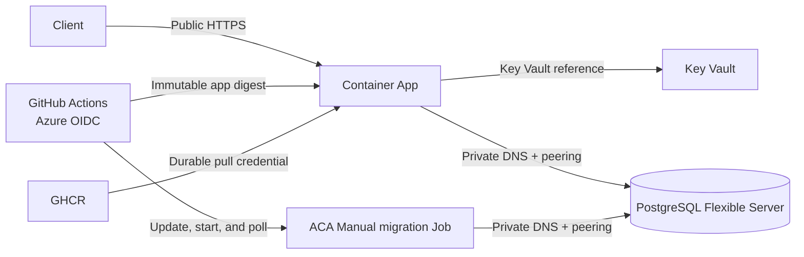

# Azure deployment saga

> **Historical incident record — not an operational runbook.** This document
> consolidates the deployment handoff and the evidence available at the time of
> the incident. For repeatable deployment and recovery instructions, use the
> [current Azure manual runbook](../manual/step-by-step-guide.md).
>
> **Record date:** 2026-08-25
>
> **Scope:** Azure learning deployment for Tax-Invoice-Issuer-FC

## Contents

- [Purpose and evidence convention](#purpose-and-evidence-convention)
- [Resolution status](#resolution-status)
- [Current topology](#current-topology)
- [Incident timeline](#incident-timeline)
- [Final pipeline flow](#final-pipeline-flow)
- [Migration truth](#migration-truth)
- [Runtime evidence supplied by the user](#runtime-evidence-supplied-by-the-user)
- [From-scratch checklist](#from-scratch-checklist)
- [Safe diagnostics](#safe-diagnostics)
- [Lessons learned](#lessons-learned)
- [Canonical references](#canonical-references)

## Purpose and evidence convention

This record preserves the sequence of failures, corrections, and runtime
observations that led to the current deployment shape. It is intentionally not a
second runbook: current commands, resource prerequisites, and recovery steps
remain in the [manual runbook](../manual/step-by-step-guide.md).

Each statement is labeled as follows:

- **Repository-verified** — directly supported by files or commits in this
  checkout. This verifies the intended or committed behavior, not that Azure is
  currently healthy.
- **Runtime evidence supplied by the user** — reported in the Copilot handoff or
  deployment session. It is retained as historical evidence and was not
  independently re-run from this documentation-only change.
- **Interpretation** — a conclusion or limitation derived from the two evidence
  classes above. It is not a new runtime test result.

No subscription IDs, object IDs, PATs, passwords, private IP addresses, request
IDs, client IP addresses, secret values, or complete `DATABASE_URL` values belong
in this record.

## Resolution status

### Repository-verified

- The current workflow builds application and migration images, validates
  immutable `sha256` digests, signs published images, logs in to Azure through
  OIDC, validates an existing Manual Container Apps migration Job, starts and
  polls that Job, and deploys the application only after migration succeeds.
- The migration image contains only `migration/create.sql`; the runner invokes
  `psql` with `--single-transaction` and `ON_ERROR_STOP=1`.
- The committed topology documentation names Brazil South, the current `-learn`
  resources, separate application and database VNets, bidirectional peering,
  private DNS, Key Vault, and GHCR without recording secret values.
- Commits [`f1b551c`](https://github.com/Samuel-Ricardo/Tax-Invoice-Issuer-FC/commit/f1b551c)
  and [`1927d73`](https://github.com/Samuel-Ricardo/Tax-Invoice-Issuer-FC/commit/1927d73)
  establish the structured invoice response expectation in the repository.

### Runtime evidence supplied by the user

The handoff reported that the deployment issues below were resolved and that:

- the migration execution succeeded;
- the application reached revision `app-tax-invoice-fc-learn--0000004`;
- the database was seeded;
- `GET /` and `POST /invoice` were exercised through Postman; and
- the reported accrual request returned three 2022 invoices.

These are recorded as user-supplied runtime evidence, not as independently
verified results of this commit. The current runbook remains the procedure for
repeating those checks.

### Still must not be claimed

- The local E2E suite did **not** pass as part of this record; local execution was
  blocked by a missing `DATABASE_URL`.
- `format: pdf` is an intentionally accepted no-op. PDF generation is not
  implemented.
- A `cash` request for 2024 returning `[]` is inconclusive because the seed is
  from 2022.
- Some error paths can return HTTP `200` with a body containing `status: 500`.
  This is a known application response-contract limitation, not proof of a
  successful request.

## Current topology

The following resource names and relationships are **repository-verified as the
documented current target**. Their live Azure state was not queried for this
documentation-only change.

| Component                  | Current target                                                                  |
| -------------------------- | ------------------------------------------------------------------------------- |
| Region                     | Brazil South                                                                    |
| Resource group             | `rg-tax-invoice-fc-learn`                                                       |
| Container Apps environment | `env-tax-invoice-fc-learn`                                                      |
| Container App              | `app-tax-invoice-fc-learn`                                                      |
| PostgreSQL Flexible Server | `psql-tax-invoice-fc-learn`                                                     |
| Key Vault                  | `kv-tax-invoice-fc-learn`                                                       |
| Log Analytics              | `law-tax-invoice-fc-learn`                                                      |
| Container image registry   | GHCR                                                                            |
| Image repository           | `ghcr.io/samuel-ricardo/tax-invoice-issuer-fc`                                  |
| Application VNet           | `vnet-tax-invoice-fc`, subnet `default`                                         |
| Database VNet              | `rg-tax-invoice-fc-learn-vnet`, subnet `default`                                |
| VNet peering               | Bidirectional; `peer-to-db-vnet` and `peer-to-app-vnet`                         |
| Private DNS zone           | `psql-tax-invoice-fc-learn.private.postgres.database.azure.com`                 |
| Private DNS link           | `link-app-vnet`, auto-registration disabled                                     |
| PostgreSQL server FQDN     | `psql-tax-invoice-fc-learn.postgres.database.azure.com`                         |
| Migration workload         | Existing Manual Azure Container Apps Job, named by `<AZURE_MIGRATION_JOB_NAME>` |

The application has public HTTPS ingress and uses the PostgreSQL FQDN over the
private network path. The database topology is PostgreSQL Flexible Server
private access/VNet integration, not a PostgreSQL Private Endpoint. The app's
system-assigned identity reads the `database-url` Key Vault secret through the
Container Apps secret reference `kv-database-url`; the value itself is never
documented here.



## Incident timeline

Dates are omitted because the handoff preserved the order of events rather than
a complete timestamped incident log.

| Sequence | Incident or change                                                                                                                                                | Resolution and evidence classification                                                                                                                                                                                                                                                                                                                                                |
| -------- | ----------------------------------------------------------------------------------------------------------------------------------------------------------------- | ------------------------------------------------------------------------------------------------------------------------------------------------------------------------------------------------------------------------------------------------------------------------------------------------------------------------------------------------------------------------------------- |
| 1        | Key Vault soft-delete blocked reuse of a vault or secret name.                                                                                                    | **Runtime evidence supplied by the user:** the affected Key Vault resource was recovered or purged as appropriate to restore the intended name. **Repository-verified:** the current docs require checking secret state and identity metadata, without recording values.                                                                                                              |
| 2        | Updating a Key Vault secret did not immediately change the running app.                                                                                           | **Repository-verified:** the runbook states that a secret or identity change requires saving the configuration and restarting the app or creating a new revision. **Interpretation:** configuration references are not evidence that an already-running revision has reread the value.                                                                                                |
| 3        | The app reported `ENOTFOUND` while resolving PostgreSQL.                                                                                                          | **Runtime evidence supplied by the user:** the issue was fixed by completing VNet peering, linking the private DNS zone to the app VNet, and restarting the app. **Repository-verified:** those are the documented current network relationships and the server FQDN is the configured connection target.                                                                             |
| 4        | The app reported that `sam.contract` was missing.                                                                                                                 | **Runtime evidence supplied by the user:** the schema was restored by using the gated ACA migration Job. **Repository-verified:** the workflow validates, updates, starts, and polls the existing Manual Job before deploying the app; the current SQL creates `sam.contract`.                                                                                                        |
| 5        | Image references were confused during setup: mutable tags, immutable digests, signature `.sig` artifacts, and registry manifests were treated as interchangeable. | **Runtime evidence supplied by the user:** these image, digest, `.sig`, and manifest mistakes were corrected. **Repository-verified:** the workflow validates `sha256:<64 hex characters>`, signs the image reference at that digest, and deploys the app and Job using digest references rather than a signature artifact or mutable tag.                                            |
| 6        | The migration Job needed a usable identity and access path to Key Vault, GHCR, and PostgreSQL.                                                                    | **Runtime evidence supplied by the user:** the Job identity, Key Vault access, and GHCR pull setup were completed. **Repository-verified:** the current contract requires `DATABASE_URL`, a valid registry secret reference, private database access, and durable GHCR credentials; the app runtime identity has Key Vault Secrets User while GitHub OIDC is the deployment identity. |
| 7        | Registry settings entered in the Azure portal did not persist as expected.                                                                                        | **Runtime evidence supplied by the user:** the portal persistence issue was worked around with supported Azure CLI configuration. **Repository-verified:** the workflow uses supported `az containerapp job show`, `az containerapp job update`, and `az containerapp job start` operations, while validating the existing registry configuration rather than silently replacing it.  |
| 8        | Registry queries in the workflow produced unreliable TSV parsing when a query returned a collection or multiline result.                                          | **Repository-verified:** the current workflow uses scalar JMESPath queries, including `[0]` selection for registry fields, and exact-line TSV checks for names. The related registry-query correction is recorded in commit [`7e83541`](https://github.com/Samuel-Ricardo/Tax-Invoice-Issuer-FC/commit/7e83541).                                                                      |
| 9        | The first migration attempt could not create `uuid-ossp` because the Flexible Server extension allowlist did not include it.                                      | **Runtime evidence supplied by the user:** adding `uuid-ossp` to the server allowlist and retrying fixed the failure. **Repository-verified:** `create.sql` requests the extension and the current runbook records the allowlist and database-principal prerequisites.                                                                                                                |
| 10       | The final deployment path needed a deterministic migration gate.                                                                                                  | **Repository-verified:** the current workflow builds both images, validates and signs their digests, authenticates with Azure OIDC, validates the existing Manual Job, updates/starts/polls it, and deploys the app only after `Succeeded`.                                                                                                                                           |

### What changed operationally

The durable correction was not “run the app again.” It was to make the database
initialization an explicit deployment gate, make the private network path
resolvable from the app and Job, make Key Vault changes take effect through a new
revision or restart, and deploy image digests with durable GHCR pull credentials.

## Final pipeline flow

The final flow below is **repository-verified as the committed workflow design**.
A successful workflow run still does not replace runtime checks at the app, Key
Vault, private database, and public HTTP boundaries.

```text
push to main
  -> build application image and migration image
  -> validate immutable image digests
  -> sign image references at those digests
  -> log in to Azure with GitHub OIDC
  -> validate the existing Manual ACA migration Job
       - Job name is present and valid
       - DATABASE_URL is configured by reference
       - GHCR registry entry and secret reference are present
       - application and migration digests are valid
  -> update the Job to the migration image digest
  -> start the Job
  -> poll the execution
       - Succeeded: continue
       - Failed, Degraded, Stopped, or Canceled: stop; do not deploy app
  -> deploy the application image by digest
```

The workflow uses `GITHUB_TOKEN` for image publication during the run. It does not
use that run-scoped token as the runtime pull credential. The app and Job use the
durable `GHCR_USERNAME` and `GHCR_READ_TOKEN` secret names configured outside this
document.

## Migration truth

This section is **repository-verified** from
[`Dockerfile.migrations`](../../../../Dockerfile.migrations),
[`migration/runner.sh`](../../../../migration/runner.sh), and
[`migration/create.sql`](../../../../migration/create.sql).

1. The migration image copies only `migration/create.sql` as the SQL payload.
2. The runner requires a PostgreSQL `DATABASE_URL`, uses `psql`, enables
   `ON_ERROR_STOP=1`, and runs the file with `--single-transaction`.
3. `migration/create.sql` intentionally runs `DROP SCHEMA sam CASCADE` when the
   schema exists.
4. It creates `uuid-ossp` when needed, recreates the `sam` schema and current
   tables, and inserts the 2022 contract/payment fixture.
5. **Every successful deployment resets and reseeds the database.** This is an
   intentional reset/reseed design, not additive version tracking.
6. Files under `migration/versions/` are retained repository content but are not
   executed by the current migration image or ACA Job. Their presence must not be
   reported as evidence that those migrations ran.
7. The Flexible Server `azure.extensions` allowlist and the database principal's
   connection, `CREATE`, and schema administration privileges are prerequisites
   for the reset.

Do not bypass a failed gate by manually claiming that a versioned migration ran.
Investigate the Job execution, private connectivity, extension allowlist, and
database privileges using the [current runbook](../manual/step-by-step-guide.md).

## Runtime evidence supplied by the user

The following observations are preserved exactly as an evidence boundary, not as
results independently reproduced by this documentation change:

| Observation                                                   | Correct interpretation                                                                                                                                                                                                                                                                                                    |
| ------------------------------------------------------------- | ------------------------------------------------------------------------------------------------------------------------------------------------------------------------------------------------------------------------------------------------------------------------------------------------------------------------- |
| Migration execution succeeded                                 | The reported ACA migration gate completed. Repository evidence explains what that Job executes; it does not independently verify the historical execution.                                                                                                                                                                |
| App revision `app-tax-invoice-fc-learn--0000004` was reached  | The reported app revision is retained as historical runtime evidence. The current revision must be checked again before a new acceptance decision.                                                                                                                                                                        |
| Database was seeded                                           | Consistent with the 2022 inserts in `migration/create.sql`; the claim itself came from the user's runtime report.                                                                                                                                                                                                         |
| `GET /` was exercised through Postman                         | Treat as a reported smoke check. Repeat it against the current Application Url and require HTTP `200` with the expected JSON object.                                                                                                                                                                                      |
| `POST /invoice` accrual returned three 2022 invoices          | This was the reported request observation and is consistent with the 2022 fixture. Record the request date and assert the parsed response is an array.                                                                                                                                                                    |
| `POST /invoice` cash for 2024 returned `[]`                   | Inconclusive. The seed is from 2022, so an empty 2024 result does not disprove seeding or connectivity.                                                                                                                                                                                                                   |
| JSON response behavior was corrected later                    | Repository commits [`f1b551c`](https://github.com/Samuel-Ricardo/Tax-Invoice-Issuer-FC/commit/f1b551c) and [`1927d73`](https://github.com/Samuel-Ricardo/Tax-Invoice-Issuer-FC/commit/1927d73) support the current contract. Runtime checks must call `pm.response.json()` and assert an array, including an empty array. |
| `format: pdf` was accepted                                    | It is intentionally a no-op. Do not report PDF generation, a PDF response, or a PDF content type as implemented.                                                                                                                                                                                                          |
| Local E2E execution was attempted                             | It was blocked by missing local `DATABASE_URL`. It must not be reported as passed.                                                                                                                                                                                                                                        |
| An error response contained HTTP `200` and body `status: 500` | This is a known application response-contract limitation on some error paths. Do not use the body alone to infer the HTTP status contract.                                                                                                                                                                                |

## From-scratch checklist

Use this compact checklist to orient a rebuild; follow the [current manual
runbook](../manual/step-by-step-guide.md) for exact instructions.

- [ ] Confirm the target is Brazil South and use only the current `-learn`
      resource names.
- [ ] Create or verify the app VNet and database VNet, non-overlapping subnets,
      both peerings, and the private DNS zone link.
- [ ] Create or verify PostgreSQL Flexible Server private access and the server
      FQDN; confirm the `uuid-ossp` allowlist and database privileges.
- [ ] Create or verify Key Vault, enabled `database-url`, app system identity,
      and Key Vault Secrets User. Keep the value in the secure portal field only.
- [ ] Configure the Container App's `kv-database-url` reference and
      `DATABASE_URL` mapping; restart or create a new revision after changes.
- [ ] Configure GHCR durable pull credentials for the app and existing Manual
      migration Job. Use `<AZURE_MIGRATION_JOB_NAME>` in notes.
- [ ] Configure the GitHub `production` secret **names** and OIDC claims; do not
      copy their values into documentation.
- [ ] Push to `main` and let the pipeline build, digest-validate, sign, gate on
      migration success, and deploy the app by digest.
- [ ] Copy the current Application Url, run `GET /`, then run date-aligned
      invoice checks with the parsed-array assertion.

## Safe diagnostics

The commands below inspect metadata only. Replace placeholders with local shell
variables or approved values; never paste their output into an issue or commit if
it contains a secret, private address, token, request identifier, client address,
or complete connection URL.

```bash
# Resource and app metadata
az group show --name <RESOURCE_GROUP> --query "{name:name,location:location}" --output yaml
az containerapp show --name <APP_NAME> --resource-group <RESOURCE_GROUP> --query "{name:name,latestRevisionName:properties.latestRevisionName,provisioningState:properties.provisioningState}" --output yaml
az containerapp revision list --name <APP_NAME> --resource-group <RESOURCE_GROUP> --query "[].{name:name,active:properties.active,replicas:properties.replicas}" --output table

# Network metadata; do not retain resolved private addresses
az network vnet peering list --vnet-name <APP_VNET_NAME> --resource-group <RESOURCE_GROUP> --query "[].{name:name,state:peeringState,remoteVnet:remoteVirtualNetwork.id}" --output table
az network private-dns link vnet list --zone-name <PRIVATE_DNS_ZONE> --resource-group <RESOURCE_GROUP> --query "[].{name:name,registrationEnabled:registrationEnabled,virtualNetwork:virtualNetwork.id}" --output table
nslookup <SERVER_FQDN>

# Migration Job metadata and latest execution status
az containerapp job show --name <MIGRATION_JOB_NAME> --resource-group <RESOURCE_GROUP> --query "{name:name,triggerType:properties.configuration.triggerType,containers:properties.template.containers[].name}" --output yaml
az containerapp job execution list --name <MIGRATION_JOB_NAME> --resource-group <RESOURCE_GROUP> --query "[].{name:name,status:properties.status}" --output table

# Public smoke test and response-shape check
curl --fail-with-body -i "<POSTMAN_BASE_URL>/"
curl --fail-with-body -sS -X POST "<POSTMAN_BASE_URL>/invoice" -H "Content-Type: application/json" -d '{"month":1,"year":2022,"type":"accrual"}'
```

For Key Vault, inspect only secret name, enabled state, identity assignment, and
reference metadata in the portal or supported CLI. Never use a command that
prints the secret value. Do not add cleanup commands for soft-deleted secrets to
this historical record; recovery or purge is a privileged, destructive action
that belongs in an approved change procedure.

## Lessons learned

1. **Separate control-plane success from runtime success.** A green build or
   deployment job does not prove image pulling after restart, Key Vault
   resolution, private DNS, database connectivity, or public HTTP behavior.
2. **Use one migration truth.** The current deployment path is the single
   `create.sql` reset/reseed transaction. Versioned files are not an implicit
   execution log.
3. **Make image identity explicit.** A tag, manifest, digest, and `.sig` artifact
   have different meanings. Validate and deploy the image digest; sign the image
   reference at that digest.
4. **Keep credentials scoped to their job.** `GITHUB_TOKEN` publishes during the
   workflow; durable GHCR credentials are required by runtime workloads. GitHub
   OIDC deploys to Azure; the app identity reads Key Vault.
5. **Treat secret changes as revision events.** A changed Key Vault value needs a
   restart or new app revision before the running process can use it.
6. **Make network dependencies observable.** VNet peering, private DNS linking,
   and the server FQDN must be checked together; fixing only one can leave
   `ENOTFOUND` unresolved.
7. **Prefer scalar automation queries.** Exact scalar JMESPath results and
   line-oriented TSV checks avoid registry-query parsing errors.
8. **Align test data with the fixture.** An empty 2024 cash response is not a
   useful seed validation when the intentional fixture is dated 2022.
9. **Assert parsed API contracts.** Check that `pm.response.json()` is an array,
   rather than trusting raw response text or an escaped JSON string.
10. **Record historical claims with their provenance.** User-reported runtime
    observations remain valuable, but they must not be presented as a fresh
    verification from repository inspection.

## Canonical references

### Current project documents

- [Current Azure manual runbook](../manual/step-by-step-guide.md) — authoritative
  deployment, recovery, migration, and verification procedure.
- [Azure deployment overview](../README.md) — concise current topology and flow.
- [Postman API verification guide](../../../../postman/README.md) — current URL,
  request, parsed-array, and limitation guidance.
- [Documentation index](../../../INDEX.md) — navigation and current-versus-legacy
  document map.
- [Project README](../../../../README.md) — project-level navigation.

### Repository evidence

- [Committed deployment workflow](../../../../.github/workflows/docker-publish.yaml)
- [Migration image definition](../../../../Dockerfile.migrations)
- [Migration runner](../../../../migration/runner.sh)
- [Reset-and-seed SQL](../../../../migration/create.sql)
- [Registry-query correction](https://github.com/Samuel-Ricardo/Tax-Invoice-Issuer-FC/commit/7e83541)
- [Structured JSON presenter fix](https://github.com/Samuel-Ricardo/Tax-Invoice-Issuer-FC/commit/f1b551c)
- [Structured invoice response tests](https://github.com/Samuel-Ricardo/Tax-Invoice-Issuer-FC/commit/1927d73)

### Official references

- [Azure Container Apps custom virtual networks](https://learn.microsoft.com/en-us/azure/container-apps/custom-virtual-networks)
- [Azure Container Apps secrets and Key Vault references](https://learn.microsoft.com/en-us/azure/container-apps/manage-secrets)
- [Azure Database for PostgreSQL private access](https://learn.microsoft.com/en-us/azure/postgresql/network/concepts-networking-private)
- [Azure workload identity federation](https://learn.microsoft.com/en-us/entra/workload-id/workload-identity-federation)
- [GitHub Container Registry](https://docs.github.com/en/packages/working-with-the-container-registry)
