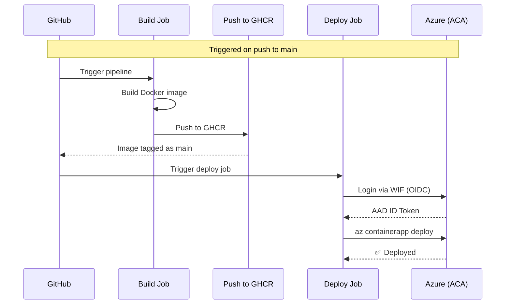

# 📚 Manual Azure Deployment Guide - Learning Exercise

> **Purpose**: This guide walks you through deploying the Tax-Invoice-Issuer-FC architecture **manually via Azure Portal** to learn Azure concepts before automating with scripts/Bicep.
>
> **Learning Goals**: Understand resource dependencies, networking concepts, security practices, and Azure service configurations.
>
> **Estimated Time**: 45-60 minutes
>
> **Prerequisites**:
>
> - Azure subscription (free tier or Pay-As-You-Go)
> - Basic knowledge of cloud concepts (VMs, databases, networking)
> - GitHub Container Registry (GHCR) image: `ghcr.io/samuel-ricardo/tax-invoice-issuer-fc:main` (built from this repo)
> - Text editor for copying/pasting values
> - **Resource providers registered** on your subscription:
>   - `Microsoft.App` (required for Container Apps)
>   - `Microsoft.OperationalInsights` (required for Log Analytics)
>   - The portal may auto-register these, but it can fail silently. Register explicitly:
>
>     ```bash
>     az provider register --namespace Microsoft.App
>     az provider register --namespace Microsoft.OperationalInsights
>     ```
>
>     Verify status with `az provider show --namespace Microsoft.App --query registrationState` (should read `Registered`).

---

## 🗺️ Architecture Overview (What We'll Build)


We'll create these Azure resources in this order (dependencies matter):

1. **Resource Group** - Logical container
2. **Virtual Network + Subnet** - Private network for secure communication
3. **PostgreSQL Flexible Server** - Database (in VNet, private endpoint)
4. **Log Analytics Workspace** - Monitoring/logs
5. **Key Vault** - Secure secret storage (for DB password)
6. **Container Apps Environment** - Serverless compute platform
7. **Container App** - Our Node.js API (scale-to-zero, from GHCR)

> 💡 **Why this order?** Some resources depend on others (e.g., Container App needs the Environment; Key Vault needs to exist before we can reference its secrets).
>
> 📝 **Portal note**: In the current Azure Portal, the Container Apps Environment (item 6) and the Container App (item 7) are created **in a single flow** — the environment is created inline during Container App creation via the "Create new environment" link on the Basics tab. They remain two distinct ARM resources, but the portal merges their creation into one wizard to streamline the experience.

---

## 📋 Step 1: Create Resource Group

**Purpose**: Logical container to hold all related resources for easy management/deletion.

1. Go to [Azure Portal](https://portal.azure.com)
2. Search for "Resource groups" → Click **+ Create**
3. Fill in:
   - **Subscription**: Your Azure subscription
   - **Resource group**: `rg-tax-invoice-fc-learn` (use `learn` suffix to distinguish from automated deployments)
   - **Region**: `East US` (or nearest to you for lower latency)
4. Click **Review + create** → **Create**

> ✅ **Verification**: You should see your new RG in the list.

---

## 🌐 Step 2: Create Virtual Network & Subnet

**Purpose**: Isolate resources in a private network. Enables secure, private connections between services (no public internet exposure for DB).

1. In your new RG (`rg-tax-invoice-fc-learn`), click **+ Create**
2. Search for "Virtual network" → Select it → **Create**
3. **Basics tab**:
   - Subscription: [your sub]
   - Resource group: `rg-tax-invoice-fc-learn`
   - Name: `vnet-tax-invoice-fc`
   - Region: Same as RG (East US)
4. **IP Addresses tab**:
   - IPv4 address space: `10.0.0.0/16`
   - Click **+ Add subnet**
     - Subnet name: `snet-tax-invoice-fc`
     - Address range: `10.0.1.0/24`
   - Click **Add**
5. **Security tab**: Leave defaults (no Bastion, DDoS protection standard)
6. Click **Review + create** → **Create**

> 🔐 **Learning Point**: This VNet will host our PostgreSQL server privately. The Container App will connect via VNet integration (not public internet).

---

## 🐘 Step 3: Create PostgreSQL Flexible Server

**Purpose**: Managed PostgreSQL database. We'll deploy it inside the VNet for security.

1. In RG, click **+ Create**
2. Search for "Azure Database for PostgreSQL flexible server" → Select → **Create**
3. **Basics tab**:
   - Subscription: [your sub]
   - Resource group: `rg-tax-invoice-fc-learn`
   - Server name: `psql-tax-invoice-fc-learn` (must be globally unique)
   - Region: Same as RG
   - Workload type: `Development` (cheaper, burstable)
   - Version: `15` (LTS)
   - Compute + storage:
     - Click **Configure**
     - Service tier: `Burstable`
     - Compute size: `B1ms` (1 vCore, 2 GiB RAM) → **Matches our architecture**
     - Storage size: `32 GiB`
     - Backup retention: `7 days`
     - Click **OK**
   - Administrator account:
     - Username: `dbadmin` (avoid `postgres` or `admin` for basic security)
     - Password: **Generate a strong password** (16+ chars, mix of types) → **SAVE THIS SECURELY**
4. **Networking tab**:
   - Connectivity method: **Private access (VNet integration)**
   - Virtual network: `vnet-tax-invoice-fc`
   - Subnet: `snet-tax-invoice-fc`
   - ✅ **Enable private endpoint** (this creates a private IP in the subnet for secure access)
5. **Security tab**:
   - Enable SSL/TLS enforcement: **Yes** (required)
   - Allow public network access: **No** (we're using private endpoint only)
6. **Tags tab**: Add optional tags (e.g., `project=tax-invoice-fc`, `environment=learn`)
7. Click **Review + create** → **Create**

> ⏳ **Wait 10-15 minutes** for deployment. This is the longest step.
>
> 🔐 **Learning Point**:
>
> - Private endpoint = database only accessible from within the VNet (no public IP)
> - We chose B1ms (burstable) for cost efficiency in learning scenario
> - Disabling public access is a critical security practice

---

## 📊 Step 4: Create Log Analytics Workspace

**Purpose**: Centralized logging and monitoring for our Container Apps.

1. In RG, click **+ Create**
2. Search for "Log Analytics workspace" → Select → **Create**
3. **Basics tab**:
   - Subscription: [your sub]
   - Resource group: `rg-tax-invoice-fc-learn`
   - Name: `law-tax-invoice-fc-learn` (must be globally unique)
   - Region: Same as RG
4. **Tags tab**: Add same tags as above (optional)
5. Click **Review + create** → **Create**

> 📈 **Learning Point**: This will collect logs from our Container App. Later we can query with Kusto (KQL) language.

---

## 🔐 Step 5: Create Key Vault & Store Secret

**Purpose**: Securely store database password (and other secrets) instead of hardcoding or using app settings.

1. In RG, click **+ Create**
2. Search for "Key vault" → Select → **Create**
3. **Basics tab**:
   - Subscription: [your sub]
   - Resource group: `rg-tax-invoice-fc-learn`
   - Key vault name: `kv-tax-invoice-fc-learn` (globally unique)
   - Region: Same as RG
   - Pricing tier: `Standard` (sufficient for learning)
4. **Access configuration tab**:
   - Permission model: **Azure role-based access control** (modern approach)
   - Leave other defaults

> ⚠️ **Important**: Confirm that **Azure role-based access control (recommended)** is selected, not **Vault access policy**. The `Key Vault Secrets User` role assigned through **Access control (IAM)** only grants data-plane access when the vault uses the Azure RBAC permission model. If this vault already exists with **Vault access policy**, select Azure RBAC and click **Apply** before configuring the Container App secret reference. 5. **Networking tab**:

- Private endpoint connections: **+ Add**
  - Name: `pe-kv-tax-invoice-fc-learn`
  - Virtual network: `vnet-tax-invoice-fc`
  - Subnet: `snet-tax-invoice-fc`
  - Click **OK**

6. Click **Review + create** → **Create**

> ⏳ Wait for deployment (~2-3 mins)

### 🔑 Add Database Password to Key Vault

1. Go to your new Key Vault (`kv-tax-invoice-fc-learn`)
2. Left menu: **Secrets** → **+ Generate/Import**
3. Create secret:
   - **Name**: `db-password` (no spaces, lowercase)
   - **Value**: [Paste the PostgreSQL admin password you saved earlier]
   - Leave other defaults (activation dates disabled)
   - Click **Create**

> 🔐 **Learning Point**:
>
> - Using Key Vault + managed identity is the Azure-recommended way to handle secrets
> - Never hardcode passwords in app settings or source code
> - Private endpoint ensures Key Vault is only accessible from our VNet

---

## 📦 Step 6: Create Container App & Environment (Our API)

**Purpose**: Deploy our Node.js application (from GHCR) to run in Azure. In the current Azure Portal, the **Container Apps Environment** and the **Container App** are created in a single wizard — the environment is created inline on the Basics tab.

> ⚠️ **Important**: The Container Apps Environment is **not** a standalone Marketplace resource you can search for and create separately. It is created **inline** during Container App creation via the "Create new environment" link on the Basics tab. If you search the Marketplace for "Container Apps environment", you will only find "Container App", "Container App Job", and "Container App Session Pool" — none of which is the environment by itself.

### Open the Container App creation wizard

1. Go to [Azure Portal](https://portal.azure.com)
2. In the **top search bar**, search for **"Container Apps"** (plural — the service name)
3. Select the **Container Apps** service from the results → click **Create** → **Container App**

### Basics tab (creates Container App + inline Environment)

4. Fill in the Container App basics:
   - Subscription: [your sub]
   - Resource group: `rg-tax-invoice-fc-learn`
   - Container app name: `app-tax-invoice-fc-learn` (globally unique)
   - Region: Same as RG (East US)

5. In the **Container Apps environment** field, click **Create new environment** — this opens the inline environment sub-wizard:

   #### Environment sub-wizard — Basics
   - **Name**: `env-tax-invoice-fc-learn`
   - **Zone redundancy**: Leave disabled (not needed for learning)

   #### Environment sub-wizard — Monitoring
   - **Log Analytics workspace**: Select `law-tax-invoice-fc-learn` (the one we created in Step 4)

   #### Environment sub-wizard — Networking
   - **Use your own virtual network**: **Yes**
   - Virtual network: `vnet-tax-invoice-fc`
   - Subnet: `snet-tax-invoice-fc`
   - **Virtual IP**: **External** (for public ingress — Azure will provision a managed TLS certificate)

   #### Environment sub-wizard — Workload profiles
   - Skip — no need to add a dedicated profile. The default **Consumption** (Workload profiles environment) is sufficient for scale-to-zero billing.

   Click **Create** to create the environment. You'll return to the Container App Basics tab with the new environment selected.

   #### Verify public access to the Managed Environment

   The Container App can use the VNet for private connections to PostgreSQL and Key Vault while still exposing its HTTP ingress publicly. These are separate settings. After the environment is created:
   1. Open the Container Apps Environment (`env-tax-invoice-fc-learn`)
   2. Open **Settings** and locate the environment networking/public access setting (the exact menu label can vary by portal version)
   3. Set **Public network access** to **Enabled** and click **Save**

   If this setting is disabled, the application URL can show the message:

   ```text
   The public network access on this managed environment is disabled.
   ```

   In that case, the Container App's **Ingress** page may still show **Ingress enabled**, **Accepting traffic from anywhere**, and a valid endpoint, but the environment blocks external traffic before it reaches the application. The VNet integration remains enabled after public network access is enabled.

   > **Cloud Shell alternative**: If the portal does not display the setting, run:
   >
   > ```bash
   > az containerapp env update \
   >   --name env-tax-invoice-fc-learn \
   >   --resource-group rg-tax-invoice-fc-learn \
   >   --public-network-access Enabled
   > ```

> 🌐 **Learning Point**:
>
> - The Managed Environment is the foundational resource where Container Apps run — it defines networking, logging, and Dapr integration for all apps in it.
> - VNet integration here allows the app to privately reach the database.
> - Public network access controls whether clients on the internet can reach the environment; it does not disable the app's private VNet connectivity.
> - Log Analytics connection enables app logging.
> - Dapr is **not** configured at the environment level in the portal — it's enabled per-Container-App post-create (Settings → Dapr). We don't need Dapr for this app.

### Container tab (image, resources, environment variables)

6. Uncheck the **Use quickstart image** checkbox (if pre-selected) to enable custom image settings.

7. **Image source**: **Docker Hub or other registries** (this option covers GHCR)

8. **Registry login server**: `ghcr.io`
   - **Image type**: **Private**
   - **Image and tag**: `samuel-ricardo/tax-invoice-issuer-fc:main`

9. **Registry credentials**:
   - **Username**: Your GitHub username
   - **Password**: **Generate a Personal Access Token (PAT)** from GitHub with `read:packages` scope:
     - Go to GitHub → Settings → Developer settings → Personal access tokens → Tokens (classic) → Generate new token
     - Select `read:packages` scope
     - Set a 90-day expiry (or per your organization's policy). **Do not use "no expiration"** — it's a security risk.
     - Generate → **COPY THIS TOKEN** (you won't see it again)
   - Note: If the GHCR image is **public**, registry credentials may not be required.

10. **Resource allocation** (sub-section within the Container tab — this sets per-replica CPU/memory):
    - CPU: `0.25` cores (minimum — matches our architecture)
    - Memory: `0.5 Gi` (minimum — matches our architecture)

11. **Environment variables** (sub-section within the Container tab):
    - Add these as plain values for now (we'll replace the password with a Key Vault reference after deployment):
      - `NODE_ENV`: `production`
      - `PORT`: `3000`
    - The `DATABASE_PASSWORD` will be bound via a **secret reference** in the post-deploy Key Vault configuration below.

### Ingress tab

12. **Ingress**: **Enabled** (allows incoming traffic to the Container App)

13. **Accepting traffic from**: **Anywhere** (public access, suitable for learning)

14. **Ingress type**: **HTTP**

15. **Transport**: **Auto** (Azure will negotiate HTTP/1 or HTTP/2 automatically)

16. **Target port**: `3000` (this is the **container target port** — what your Node.js app listens on internally)

    > ⚠️ **Port clarification**: The Target port (`3000`) is the port your container listens on. **External** access is via **HTTPS on port 443** — Azure provisions a **managed TLS certificate** automatically and terminates TLS at the ingress. The public-facing URL uses HTTPS on the standard port.
    >
    > Leave the **Insecure connections** checkbox **unchecked** — this disables plaintext external access and forces HTTPS-only, which is the recommended default.

### Scaling tab

17. **Minimum replicas**: `0` (scale-to-zero = free when idle)
18. **Maximum replicas**: `1` (enough for learning/demo)
19. **Scale rule**:
    - Type: **HTTP**
    - Concurrent requests: `10`

### Review + create

20. Click **Review + create** → review the summary → **Create**

> ⏳ Wait for deployment (~2-3 mins)

### 🔑 Configure Secure Database Connection via Key Vault

Now we'll bind the database password and connection values to the Container App using **Key Vault references** — the Container Apps-native secrets mechanism.

> ⚠️ **Important — Container Apps secrets mechanism**: Container Apps uses a secrets model that is distinct from App Service. Do **not** look for a "Configuration → Application settings" blade with a key-vault-icon picker (that's the App Service flow). Container Apps has a dedicated **Secrets** management surface under the **Security** section of the Container App resource. Environment variables bind to secrets via `secretRef` (mirroring how the Bicep template works — see `infra_public/main.bicep` lines 129–135 and 164–165).

#### Step A: Enable system-assigned managed identity (required for Key Vault access)

1. Go to your Container App (`app-tax-invoice-fc-learn`)
2. Left menu: **Security** section → **Identity**
3. Under **System assigned**, toggle the status to **On** → **Save**
4. Note the **Object (principal) ID** — you'll need this (or the managed identity name) for the Key Vault role assignment below.

> 🔐 **Learning Point**: The system-assigned managed identity is how the Container App authenticates to Key Vault without storing any credentials. Until you enable it, the Container App cannot read Key Vault secrets via RBAC.

#### Step B: Grant Container App access to Key Vault

Grant access before creating the Container Apps reference. Container Apps validates the Key Vault secret while provisioning the revision, so the identity must already be authorized.

1. Go to your Key Vault (`kv-tax-invoice-fc-learn`)
2. Open **Access control (IAM)** → **+ Add** → **Add role assignment**
3. Select the role **Key Vault Secrets User**
4. For **Assign access to**, select **Managed identity**
5. Select members:
   - Subscription: [your sub]
   - Resource group: `rg-tax-invoice-fc-learn`
   - Managed identity: `app-tax-invoice-fc-learn` (the system-assigned identity)
6. Click **Review + assign** → **Review + assign**

> 🔎 **Verify the identity**: Use the current **Object (principal) ID** shown under Container App → **Identity**. If the system-assigned identity was disabled and enabled again, its principal ID may have changed; a role assignment for the old ID will not work.

#### Step C: Add non-secret environment variables

1. Go to your Container App (`app-tax-invoice-fc-learn`)
2. Left menu: **Configuration** (or **Containers** → **Environment variables**, depending on portal version)
3. Add or confirm these **plain** environment variables:
   - `DATABASE_HOST`: `psql-tax-invoice-fc-learn.postgres.database.azure.com`
     _(Find this in your PostgreSQL server's Overview page → "Server name")_
   - `DATABASE_PORT`: `5432`
   - `DATABASE_USER`: `dbadmin` (the admin username we set earlier)
   - `DATABASE_NAME`: `invoicesdb` (aligns with the Bicep template — `infra_public/main.bicep` defines `databaseName = 'invoicesdb'`)
   - `NODE_ENV`: `production`
   - `PORT`: `3000`
4. Click **Save / Apply**

#### Step D: Create a Key Vault reference secret in the Container App

1. Still on your Container App (`app-tax-invoice-fc-learn`) → left menu **Security** section → **Secrets**
2. Click **+ Add** (or **Add secret**)
3. Configure the secret:
   - **Type**: **Key Vault reference**
   - **Name**: `kv-postgres-password` (this is the internal secret name the env var will bind to)
   - **Key Vault URI**: The full secret URI — for example:
     `https://kv-tax-invoice-fc-learn.vault.azure.net/secrets/db-password`
     _(To find the full URI: go to Key Vault → Secrets → `db-password` → copy the "Secret Identifier" value. The URI includes the version segment if you pick a specific version; omitting the version always resolves to the latest.)_
   - **Identity**: **System assigned** (uses the identity you enabled in Step A)
4. Click **Add** → **Save**

#### Step E: Bind the DATABASE_PASSWORD environment variable to the secret

1. Still on your Container App → left menu **Configuration** (or **Containers** → **Environment variables**)
2. Add (or edit) the `DATABASE_PASSWORD` environment variable:
   - **Name**: `DATABASE_PASSWORD`
   - **Source**: **Reference Container Apps secret** (i.e., bind via `secretRef`)
   - **Secret name**: `kv-postgres-password` (the secret you created in Step C)
3. Click **Save / Apply**

> 🔐 **Learning Point**:
>
> - The app never sees the actual password — it gets injected at runtime via the Container Apps secrets mechanism, sourced from Key Vault by the managed identity.
> - This mirrors the Bicep deployment exactly: `secrets: [{name:'kv-postgres-password', keyVaultUrl, identity:'system'}]` + `env:[{name:'DATABASE_PASSWORD', secretRef:'kv-postgres-password'}]` (see `infra_public/main.bicep` L129–135 and L164–165).
> - Container Apps does **not** use the `@Microsoft.KeyVault(...)` reference syntax — that's for App Service. Container Apps uses the `secretRef` model instead.

### 🧭 Troubleshooting: `Unable to fetch secret`

If the revision fails with an error such as `Field 'configuration.secrets' is invalid` or `Unable to fetch secret`, check these items in order:

1. In Key Vault → **Settings** → **Access configuration**, confirm **Permission model: Azure role-based access control**. An IAM role does not grant secret access while the vault is using **Vault access policy**.
2. In Key Vault → **Access control (IAM)** → **Check access**, confirm that the Container App's current principal ID has **Key Vault Secrets User**. The `Owner` role alone does not grant Key Vault data-plane secret access.
3. In Key Vault → **Secrets** → `db-password`, confirm **Enabled: Yes** and that the secret has a non-empty value. Do not expose the value in logs or screenshots.
4. Copy the **Secret Identifier** from the secret and use the URI without a version first:
   `https://kv-tax-invoice-fc-learn.vault.azure.net/secrets/db-password`
5. To isolate the problem, create a temporary non-sensitive Key Vault secret such as `aca-test` with value `ok`, then reference it as `kv-aca-test`. A local Container Apps secret does not test the Key Vault integration.
6. If both Key Vault secrets fail and the vault uses a private endpoint, verify that the private endpoint is **Approved** with provisioning state **Succeeded**, that its NIC private IP matches the A record in `privatelink.vaultcore.azure.net`, and that the DNS zone is linked to `vnet-tax-invoice-fc`. As a reversible diagnostic, temporarily test with the private DNS link removed while public access is enabled; restore the private networking configuration after the test.

> 🔑 **Learning Point**:
>
> - The `Key Vault Secrets User` role must be assigned to the current system-assigned identity, at the Key Vault scope whenever possible.
> - Avoid granting `Owner` to the Container App identity; it is broader than necessary.
> - The most specific fix for this manual deployment was switching the Key Vault permission model from **Vault access policy** to **Azure role-based access control**, then retrying the reference.

---

## 🚀 Step 7: Automating Deployment with GitHub Actions + Workload Identity Federation

> **Purpose**: Replace manual portal deployments with an automated CI/CD pipeline. GitHub Actions builds and pushes the container image, then deploys to Azure Container Apps using **Workload Identity Federation (WIF)** — no long-lived secrets, no service principals, no client secrets to rotate.
>
> **Learning Goals**: Understand how OIDC-based authentication works between GitHub and Azure, how federated credentials are configured, and the critical subject claim formats that determine whether authentication succeeds.
>
> **Estimated Time**: 20-30 minutes (mostly waiting for Azure propagation)

### Overview: What Happens in the Pipeline

The CI/CD workflow is defined in `.github/workflows/docker-publish.yaml` and contains two jobs:



| Job      | Purpose                        | Key Action                                        |
| -------- | ------------------------------ | ------------------------------------------------- |
| `build`  | Build the Docker image         | `docker build` + `docker push` to GHCR            |
| `deploy` | Deploy to Azure Container Apps | `azure/login@v2` (WIF) → `az containerapp update` |

**Trigger**: Push to the `main` branch.

**Approval gates**: The deploy job runs in the `production` environment, which can require manual approval in GitHub before execution.

---

### 📄 The GitHub Actions Workflow

Here's the full workflow file with annotations:

```yaml
name: Build and Deploy to Azure

on:
  push:
    branches: [main]

env:
  REGISTRY: ghcr.io
  IMAGE_NAME: ${{ github.repository }}

jobs:
  build:
    runs-on: ubuntu-latest
    permissions:
      contents: read
      packages: write

    steps:
      - name: Checkout repository
        uses: actions/checkout@v4

      - name: Log in to GitHub Container Registry
        uses: docker/login-action@v3
        with:
          registry: ghcr.io
          username: ${{ github.actor }}
          password: ${{ secrets.GITHUB_TOKEN }}

      - name: Extract metadata
        id: meta
        uses: docker/metadata-action@v5
        with:
          images: ${{ env.REGISTRY }}/${{ env.IMAGE_NAME }}
          tags: |
            type=sha,prefix=
            type=raw,value=main

      - name: Build and push Docker image
        uses: docker/build-push-action@v6
        with:
          context: .
          push: true
          tags: ${{ steps.meta.outputs.tags }}
          labels: ${{ steps.meta.outputs.labels }}

  deploy:
    runs-on: ubuntu-latest
    needs: build
    environment: production # ← triggers approval gate

    permissions:
      id-token: write # ← required for WIF (OIDC)
      contents: read

    steps:
      - name: Login to Azure
        uses: azure/login@v2
        with:
          # NO creds: block here — using Workload Identity Federation
          # Authentication is via OIDC federated credential
          # The GitHub Actions runner exchanges its OIDC token for an Azure AAD token
          subscription: ${{ secrets.AZURE_SUBSCRIPTION_ID }}

      - name: Deploy to Container Apps
        uses: azure/CLI@v2
        with:
          inlineScript: |
            az config set extension.use_dynamic_install=yes_without_prompt
            az containerapp update \
              --name app-tax-invoice-fc \
              --resource-group rg-tax-invoice-fc \
              --image ${{ env.REGISTRY }}/${{ env.IMAGE_NAME }}:main
```

**Key elements to understand:**

| Element                                              | Why It Matters                                                              |
| ---------------------------------------------------- | --------------------------------------------------------------------------- |
| `environment: production`                            | Enables approval gates; changes the GitHub subject claim format (see below) |
| `permissions: id-token: write`                       | Required so GitHub can mint an OIDC token for Azure to validate             |
| `azure/login@v2` without `creds:`                    | This is what makes WIF work — no username/password or client secret         |
| `subscription: ${{ secrets.AZURE_SUBSCRIPTION_ID }}` | The federated identity must have access to this subscription                |

> 🔐 **Learning Point**:
>
> - The `id-token: write` permission tells GitHub Actions it can request an OpenID Connect (OIDC) token from the GitHub runner's metadata service.
> - Azure validates this token by checking: Does the token's `sub` claim match a federated credential registered in Azure?
> - If the credential exists and matches, Azure issues a short-lived AAD access token — the pipeline uses that to call `az` CLI commands.
> - This eliminates the need for long-lived credentials (client secrets, service principals) that must be rotated periodically.

---

### 🔐 Azure Side: Setting Up Workload Identity Federation

Workload Identity Federation is Azure's implementation of [federated identity credentials](https://learn.microsoft.com/en-us/azure/active-directory/workload-identities/workload-identities-overview). It allows GitHub (an external identity provider) to authenticate to Azure without credentials.

#### Step 1: Create a User-Assigned Managed Identity

1. Go to [Azure Portal](https://portal.azure.com)
2. In your resource group (`rg-tax-invoice-fc`), click **+ Create**
3. Search for "User-assigned managed identity" → Select it → **Create**
4. Fill in:
   - **Subscription**: Your Azure subscription
   - **Resource group**: `rg-tax-invoice-fc`
   - **Region**: Same as your resource group
   - **Name**: `mi-github-actions-fc` (or any name you prefer)
5. Click **Review + create** → **Create**

> ✅ **Verification**: Navigate to the managed identity blade. Note the **Object (principal) ID** — you'll need it later if diagnosing issues.

#### Step 2: Assign the Contributor Role

The managed identity needs permission to deploy/update Container Apps. Assign the **Contributor** role scoped to the resource group.

1. Navigate to the managed identity (`mi-github-actions-fc`)
2. Click **Access control (IAM)** → **+ Add** → **Add role assignment**
3. Search for and select **Contributor** → **Next**
4. Under **Assign access to**, select **Managed identity**
5. Click **+ Select members** → Search for and select `mi-github-actions-fc` → **Select**
6. Click **Review + assign** → **Review + assign**

> ✅ **Verification**: Confirm the role assignment appears in the managed identity's IAM blade.

> 🔐 **Learning Point**:
>
> - **Why Contributor, not Owner?** Contributor allows deployment and modification but not permission management. This follows the principle of least privilege.
> - **Scope**: We assign at the resource group level, not the subscription level. This means the identity can only manage resources within `rg-tax-invoice-fc`, not your entire subscription.

#### Step 3: Register the Federated Credential

This is the critical step where you tell Azure: "When GitHub sends an OIDC token claiming to be from this repository/environment, trust it if the subject claim matches this pattern."

1. In the managed identity blade, under **Settings**, click **Federated credentials**
2. Click **+ Add federated credential**
3. Fill in:
   - **Federated credential name**: `github-actions-production` (or any descriptive name)
   - **Federated credential type**: Select **GitHub Actions deploying Azure resources**
   - **Organization**: `Samuel-Ricardo` (your GitHub organization/username)
   - **Repository**: `Tax-Invoice-Issuer-FC`
   - **Environment**: `production` (must match the `environment:` in your workflow)
   - **Workload identity pool subject**: This is auto-generated based on the fields above — **do NOT edit this** (see Subject Claim Format below)
4. Click **Add**

> ✅ **Verification**: The credential should appear in the federated credentials list. Note the exact **Subject** value — it must match precisely with what GitHub sends.

> 🔐 **Learning Point**:
>
> - Azure does an **exact string comparison** on the subject claim. Even one character mismatch will cause authentication to fail.
> - The subject claim format depends on two factors: (1) whether your repository was created before or after July 15, 2026, and (2) whether your GitHub workflow uses `environment:` configuration.
> - This is the #1 cause of the `AADSTS70025` error — more on this in the Subject Claim Format section below.

---

### 🔗 Configure GitHub Environment Secrets

GitHub needs to know which Azure subscription to deploy to. Store these values as **environment-scoped secrets** (not repository-scoped) so they're only available in the `production` environment:

1. Go to your GitHub repository → **Settings** → **Environments**
2. Click **New environment** → Name it `production`
3. Enable **Required reviewers** if you want manual approval gates (recommended for production)
4. Under **Environment secrets**, add:

| Secret Name             | Value                      |
| ----------------------- | -------------------------- |
| `AZURE_SUBSCRIPTION_ID` | Your Azure subscription ID |

> ✅ **Verification**: Confirm the secret is visible in the environment's secrets list. It should NOT appear under repository-level secrets.

---

### 🧠 Subject Claim Formats — The Most Critical Concept

This is where most people get stuck. The **subject claim** (`sub` field in the OIDC token) is what Azure uses to match the incoming authentication request to a registered federated credential.

#### How GitHub Constructs the Subject Claim

GitHub's subject claim format depends on **two variables**:

| Variable                       | Effect                                                                                                                                                            |
| ------------------------------ | ----------------------------------------------------------------------------------------------------------------------------------------------------------------- |
| **Repository creation date**   | Repos created **before July 15, 2026** use name-based identifiers. Repos created **on or after** that date use immutable IDs.                                     |
| **`environment:` in workflow** | When `environment:` is set, GitHub includes it in the subject claim (`:environment:name`). Without it, the claim is just `repo:owner/repo:ref:branch` or similar. |

#### Old Format (Name-Based, Pre-July 2026 repos, no `environment:`)

```
repo:Samuel-Ricardo/Tax-Invoice-Issuer-FC:ref:refs/heads/main
```

#### Old Format (Name-Based, Pre-July 2026 repos, with `environment:`)

```
repo:Samuel-Ricardo/Tax-Invoice-Issuer-FC:environment:production
```

#### New Format (Immutable IDs, Post-July 2026 repos, with `environment:`)

```
repo:Samuel-Ricardo@<OWNER_ID>/Tax-Invoice-Issuer-FC@<REPO_ID>:environment:production
```

Where `<OWNER_ID>` and `<REPO_ID>` are numeric GitHub-assigned identifiers (e.g., `12345678` and `87654321`).

#### New Format (Immutable IDs, Post-July 2026 repos, without `environment:`)

```
repo:Samuel-Ricardo@<OWNER_ID>/Tax-Invoice-Issuer-FC@<REPO_ID>:ref:refs/heads/main
```

> 🔐 **Critical Learning Point**:
>
> 1. **GitHub sends what it sends** — you don't choose the format. It's determined by your repository's creation date and workflow configuration.
> 2. **Azure does exact string matching** — if the subject claim from GitHub doesn't match the subject value you registered in the federated credential, authentication fails with `AADSTS70025`.
> 3. **The `environment:` keyword in your workflow changes the claim** — even if the repository is new-format, adding `environment:` causes GitHub to include `:environment:production` in the subject claim instead of the ref-based format.

#### How to Check What Your Repository Sends

Add this step temporarily to your workflow to see what subject claim GitHub is actually sending:

```yaml
- name: Debug OIDC Subject Claim
  run: |
    TOKEN=$(curl -H "Authorization: bearer $ACTIONS_ID_TOKEN_REQUEST_TOKEN" \
      "$ACTIONS_ID_TOKEN_REQUEST_URL&audience=api.github.com")
    echo "$TOKEN" | python3 -c "import sys,json; print(json.load(sys.stdin)['value'])"
```

Or, more simply, check the OIDC token payload at runtime. The subject claim will be logged when authentication fails, giving you the exact string Azure received.

#### How to Enable Immutable Claims for Your Repository

If your repository was created before July 15, 2026, and you want to use the more secure immutable ID format:

1. Go to GitHub → **Settings** → **Actions** → **General**
2. Scroll to **Workload identity federation** section
3. Enable **Use immutable workflow subject claims**
4. After enabling, **re-add the federated credential** in Azure — the subject claim format will change immediately

> 🔐 **Learning Point**:
>
> - Immutable claims are **more secure** because they can't be spoofed by renaming a repository or organization.
> - If you rename your repo or organization, old name-based claims still match old credentials but new credentials must use the new names. With immutable claims, the numeric IDs never change — no credential updates needed.
> - After enabling immutable claims, **delete and re-create** the federated credential in Azure. The old credential's subject will no longer match what GitHub sends.

---

### 🧪 End-to-End Verification

After configuring everything, trigger a deployment to verify the full pipeline works:

1. Make a small change to your code (even a comment in a README)
2. Commit and push to `main`
3. Go to GitHub → **Actions** tab
4. Watch the pipeline run:
   - **Build job**: Should complete successfully (Docker build + push to GHCR)
   - **Deploy job**: Should reach `azure/login@v2` — this is where WIF is tested
     - If WIF is misconfigured, you'll see an error at this step (not later)
     - If the error is `AADSTS70025` or `AADSTS700213`, the subject claim doesn't match — check the [Subject Claim Formats](#-subject-claim-formats---the-most-critical-concept) section
5. If deploy succeeds, verify the Container App:
   - Go to Azure Portal → Container Apps → `app-tax-invoice-fc`
   - Check **Revisions** — you should see a new revision with the updated image
   - Click the URL to verify the app is running

---

### 🧭 Troubleshooting

| Error                                    | Cause                                                                                                     | Fix                                                                                                                                                                                       |
| ---------------------------------------- | --------------------------------------------------------------------------------------------------------- | ----------------------------------------------------------------------------------------------------------------------------------------------------------------------------------------- |
| `AADSTS70025`                            | Subject claim mismatch — GitHub sent a `sub` claim that doesn't match any registered federated credential | Compare the `sub` from the error message with the subject in your Azure federated credential. They must be **identical**.                                                                 |
| `AADSTS700213`                           | Same as AADSTS70025 — invalid input parameter (the subject claim is malformed or not recognized)          | Check if your repo uses old vs. new format. Check if `environment:` is configured in the workflow. Re-register the credential with the correct format.                                    |
| `AADSTS70021`                            | Propagation delay — the federated credential was just created and Azure hasn't fully propagated it yet    | **Wait 5-10 minutes** and retry. This is normal after creating or modifying federated credentials.                                                                                        |
| `401 / 403` on Container Apps operations | The managed identity doesn't have permission on the resource group                                        | Confirm the Contributor role assignment is on `rg-tax-invoice-fc`, not on the subscription or a different scope.                                                                          |
| `Image pull failed` / `Unauthorized`     | GHCR image not accessible                                                                                 | Confirm the build job successfully pushed the image. Check GHCR: your repository → Packages → verify the image exists with the expected tag.                                              |
| Deploy job stuck at `azure/login@v2`     | OIDC token request failing                                                                                | Check `id-token: write` permission is set in the workflow. Check internet connectivity from the runner. Verify the `AZURE_SUBSCRIPTION_ID` secret exists in the `production` environment. |

#### Common Mistakes Checklist

- [ ] **Wrong environment name**: The federated credential's environment (`production`) must match the workflow's `environment:` value exactly
- [ ] **Personal repo vs. organization**: For personal repos, the "Organization" field in the federated credential accepts your GitHub **username**, not an organization name
- [ ] **Auto-generated subject edited manually**: Never manually type the subject claim — always use the auto-generated value from the Azure Portal. If you edit it, you may introduce invisible characters or casing differences
- [ ] **Old credential after enabling immutable claims**: After enabling immutable claims in GitHub Settings, delete and re-add the federated credential in Azure — the old one will have stale name-based subject claims
- [ ] **Propagation wait**: After creating/modifying a federated credential, wait 5-10 minutes before testing. Azure's global propagation is not instantaneous

> 🔑 **Final Learning Point**:
>
> - Workload Identity Federation is Azure's answer to the problem of long-lived secrets in CI/CD. It leverages OIDC (OpenID Connect) — the same protocol that lets you "Sign in with GitHub" on websites.
> - The security model: GitHub mints a short-lived OIDC token (expires in ~5 minutes). Azure validates it against registered federated credentials. Azure then issues its own short-lived AAD token. No secrets stored anywhere.
> - The subject claim is the **fingerprint** that links the GitHub identity to the Azure credential. It must match exactly — Azure does not do fuzzy matching.
> - Immutable claims (numeric IDs) are the future-proof option. Enable them in GitHub Settings and update your Azure federated credentials accordingly.

---
