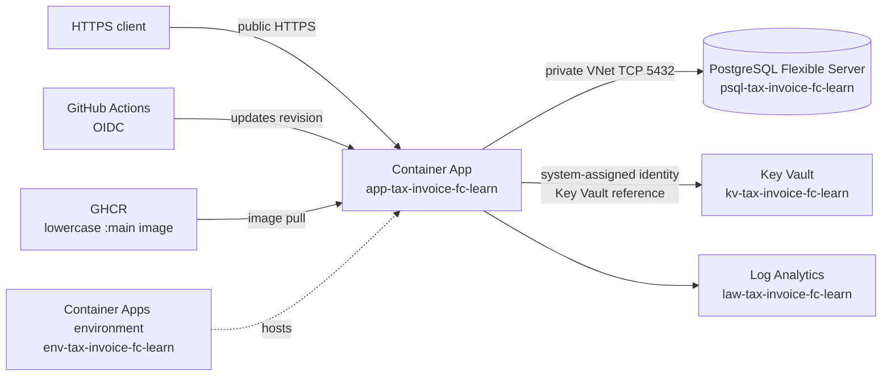

# Manual Azure deployment and current GitHub Actions workflow

> **Source of truth:** This guide describes the current Azure learning stack and
> the workflow that deploys to it. The four workflow target values below are
> canonical and must not be replaced with legacy Bicep names.
>
> **Reviewed:** 2026-08-20
>
> Portal labels vary by subscription, region, and Azure Container Apps
> environment type. When a label differs, verify the resulting resource and
> follow the current Azure documentation for the selected environment type.

## Contents

- [Scope and canonical target](#scope-and-canonical-target)
- [Architecture](#architecture)
- [Prerequisites](#prerequisites)
- [Network design](#network-design)
- [Manual Portal deployment](#manual-portal-deployment)
  - [1. Create the resource group](#1-create-the-resource-group)
  - [2. Create the VNet and separate subnets](#2-create-the-vnet-and-separate-subnets)
  - [3. Create PostgreSQL Flexible Server](#3-create-postgresql-flexible-server)
  - [4. Create Log Analytics](#4-create-log-analytics)
  - [5. Create Key Vault and `DATABASE_URL`](#5-create-key-vault-and-database_url)
  - [6. Create the Container Apps environment and app](#6-create-the-container-apps-environment-and-app)
  - [7. Grant Key Vault access and bind the secret](#7-grant-key-vault-access-and-bind-the-secret)
  - [8. Initialize the database schema](#8-initialize-the-database-schema)
  - [9. Verify the deployment](#9-verify-the-deployment)
- [Current GitHub Actions deployment](#current-github-actions-deployment)
- [Troubleshooting](#troubleshooting)
- [Operational notes](#operational-notes)
- [References](#references)

## Scope and canonical target

The current successful workflow target is exactly:

| Target                     | Canonical value                                     |
| -------------------------- | --------------------------------------------------- |
| Resource group             | `rg-tax-invoice-fc-learn`                           |
| Container Apps environment | `env-tax-invoice-fc-learn`                          |
| Container App              | `app-tax-invoice-fc-learn`                          |
| Image                      | `ghcr.io/samuel-ricardo/tax-invoice-issuer-fc:main` |

The recorded supporting resources for the learning deployment are:

| Resource                   | Recorded value              |
| -------------------------- | --------------------------- |
| PostgreSQL Flexible Server | `psql-tax-invoice-fc-learn` |
| Key Vault                  | `kv-tax-invoice-fc-learn`   |
| Log Analytics workspace    | `law-tax-invoice-fc-learn`  |

The workflow updates an existing Container App. It does not create the private
network, PostgreSQL server, database schema, Key Vault, or RBAC configuration.
Complete the manual setup first, or create an equivalent target deliberately.

### Legacy/default Bicep stack

The public Bicep template and older deployment documents describe a separate
legacy/default stack. Examples include:

- `rg-tax-invoice-fc`
- `cae-tax-invoice-fc`
- `ca-tax-invoice-fc-api`
- `psql-tax-invoice-fc`
- `law-tax-invoice-fc`
- `kv-tax-invoice-fc`

These are not aliases for the current `-learn` stack. The Bicep template does
**not** provision the current successful learning workflow target. Do not mix
its names, network model, or database-variable examples with this guide.

## Architecture

The learning topology uses private PostgreSQL access and public HTTPS ingress
for the API. Key Vault uses Azure RBAC. The simple Key Vault path uses public
network access; a private endpoint is optional and is not assumed to exist.



## Prerequisites

### Azure and Portal access

You need an Azure subscription and permission to create or coordinate:

- the resource group and VNet;
- PostgreSQL Flexible Server and its database;
- Log Analytics, Key Vault, Container Apps, and the environment;
- Azure RBAC role assignments.

If you cannot assign roles, ask an administrator to perform the assignments.
The GitHub deployment identity and the Container App runtime identity are
separate identities with separate permissions.

### Repository and database access

Have the following ready:

- this repository and the `migration/create.sql` file;
- a PostgreSQL client such as `psql`;
- a host with a valid network path to the private VNet, such as an approved
  VPN-connected or VNet-connected administration host;
- a strong PostgreSQL administrator password stored in a password manager.

A normal laptop or ordinary Azure Cloud Shell session is **not automatically
connected** to a custom VNet. Do not assume either can reach a private
PostgreSQL server.

### GHCR credentials

For the manual Portal path, a private GHCR package requires a durable GitHub
PAT with only `read:packages` (and any other permission required by the
organization's policy). Never commit, paste, screenshot, or echo the PAT.

The current workflow uses the run-scoped `GITHUB_TOKEN` instead. It is
short-lived and ephemeral. It can be insufficient for a later Container Apps
restart or scale-to-zero image pull, so it is not a durable production
registry solution. Prefer ACR with Container Apps managed identity, or use a
dedicated durable read-only PAT as a follow-up.

## Network design

Use one VNet with distinct subnets. The separation is mandatory even when the
Portal offers to create resources in one flow.

| Purpose                    | Recommended name                              | Address/delegation rule                                                                                              |
| -------------------------- | --------------------------------------------- | -------------------------------------------------------------------------------------------------------------------- |
| PostgreSQL private access  | `snet-psql-tax-invoice-fc-learn`              | Dedicated subnet delegated for PostgreSQL Flexible Server; use the size required by the selected Azure documentation |
| Container Apps custom VNet | `snet-aca-tax-invoice-fc-learn`               | Separate dedicated subnet; use the size and delegation required by the selected Container Apps environment type      |
| Optional private endpoints | `snet-private-endpoints-tax-invoice-fc-learn` | Third, non-delegated subnet; use only for private endpoints                                                          |

### PostgreSQL private access

This guide uses **PostgreSQL Flexible Server private access (VNet
integration)**:

1. Create a dedicated PostgreSQL subnet.
2. Apply the PostgreSQL Flexible Server delegation required by the Portal.
3. Create or select the PostgreSQL private DNS zone offered by the Portal.
4. Link that private DNS zone to the VNet.
5. Select that subnet when creating the PostgreSQL server.

Do not place the Container Apps environment or a private endpoint in the
PostgreSQL subnet.

Private access is not the same design as public PostgreSQL access plus a
PostgreSQL private endpoint. Do not combine those models in one deployment.
If you intentionally choose a different PostgreSQL networking model, stop using
this section and follow the current Azure documentation for that model.

### Container Apps custom VNet

Create a second, dedicated subnet for the Container Apps environment. The
Portal may offer Workload profiles or a legacy Consumption-only environment.
Subnet size and delegation differ between environment types and can change
with Azure's supported configuration. Follow the current requirements shown by
the selected Portal flow and official documentation.

Do not copy a Workload profiles example subnet into a legacy Consumption-only
environment, or reuse the PostgreSQL subnet. The invariant is that Container
Apps and PostgreSQL use separate dedicated subnets.

### Optional private endpoints

The simple learning path does not claim that a private endpoint is present. If
a policy requires a private endpoint for Key Vault or another service:

1. Create a third, non-delegated subnet for private endpoints.
2. Do not use the delegated PostgreSQL or Container Apps subnet.
3. Create or select the Key Vault private DNS zone
   `privatelink.vaultcore.azure.net`.
4. Link the zone to the VNet.
5. Confirm the endpoint is approved and succeeded before restricting Key Vault
   public access.

A private endpoint without correct private DNS does not provide working private
name resolution. If public network access is disabled, also verify that the
Container Apps runtime has a network path to the endpoint.

## Manual Portal deployment

Complete the steps in order. The workflow can update the app only after these
supporting resources and permissions exist.

### 1. Create the resource group

1. Open the [Azure Portal](https://portal.azure.com).
2. Search for **Resource groups** and select **Create**.
3. Enter:
   - **Resource group:** `rg-tax-invoice-fc-learn`.
   - **Region:** the region selected for this learning deployment. The recorded
     deployment used Brazil South.
4. Select **Review + create**, validate the name, and select **Create**.

Do not use `rg-tax-invoice-fc` for the current workflow.

### 2. Create the VNet and separate subnets

1. In `rg-tax-invoice-fc-learn`, create a Virtual network.
2. Use a distinct name such as `vnet-tax-invoice-fc-learn`.
3. Add the dedicated PostgreSQL subnet described in
   [PostgreSQL private access](#postgresql-private-access).
4. Add the separate Container Apps subnet described in
   [Container Apps custom VNet](#container-apps-custom-vnet).
5. If private endpoints are required, add the third non-delegated subnet
   described in [Optional private endpoints](#optional-private-endpoints).
6. Create or link the PostgreSQL private DNS zone to the VNet.

Before continuing, verify that the PostgreSQL and Container Apps subnets are
not the same subnet. Verify all CIDR sizes and delegations against the Portal
flow for the selected environment type.

### 3. Create PostgreSQL Flexible Server

1. In `rg-tax-invoice-fc-learn`, create **Azure Database for PostgreSQL
   Flexible Server**.
2. Use the recorded learning resource name `psql-tax-invoice-fc-learn` if you
   are rebuilding that stack.
3. Select the same region as the VNet.
4. Choose **Private access (VNet integration)**, not public access plus a
   private endpoint.
5. Select the dedicated PostgreSQL subnet and the linked private DNS zone.
6. Choose a supported PostgreSQL version and learning SKU according to the
   current Portal options and budget.
7. Set an administrator username and a strong password. Keep the password out
   of the repository and documentation.
8. Enable SSL/TLS enforcement according to the service configuration.
9. Create the server and wait until its state is **Ready**.
10. Create the application database, for example `invoicesdb`.

Copy the server FQDN from **Overview** for use in the secret value. Do not put
the administrator password in the URL shown in documentation.

### 4. Create Log Analytics

1. In `rg-tax-invoice-fc-learn`, create a **Log Analytics workspace**.
2. Use the recorded learning name `law-tax-invoice-fc-learn` if you are
   rebuilding that stack.
3. Select the same region and create the workspace.

You will select this workspace when creating the Container Apps environment.

### 5. Create Key Vault and `DATABASE_URL`

#### Create the vault

1. In `rg-tax-invoice-fc-learn`, create a Key Vault named
   `kv-tax-invoice-fc-learn` if you are rebuilding the recorded stack.
2. Under **Access configuration**, select **Azure role-based access control**.
   Do not select the legacy vault access-policy model for this guide.
3. For the simple learning path, keep public network access enabled.
4. If you use a private endpoint instead, complete the optional private-endpoint
   network and DNS steps first. Do not claim a private endpoint is present
   unless you verified it in the Portal.
5. Create the vault.

The Container App's system-assigned managed identity will later receive
**Key Vault Secrets User** on this vault. The GitHub OIDC deployment identity is
different and does not read this runtime secret.

#### Store the complete connection URL

The application reads exactly one required database variable:

```text
DATABASE_URL
```

It does not assemble a connection string from
`DATABASE_HOST`, `DATABASE_PORT`, `DATABASE_USER`, `DATABASE_NAME`, and
`DATABASE_PASSWORD` variables.

1. Open the Key Vault **Secrets** blade.
2. Select **Generate/Import** and choose **Manual**.
3. Create a secret named `database-url`.
4. Store a complete URL using placeholders like this:

   ```text
   postgresql://<DATABASE_USER>:<URL_ENCODED_PASSWORD>@<PRIVATE_POSTGRES_FQDN>:5432/<DATABASE_NAME>?sslmode=require
   ```

5. Replace the placeholders only in the secure Portal field. URL-encode
   reserved password characters such as `@`, `:`, `/`, and `#`.
6. Do not print, copy into a ticket, or commit the resulting value.

A password-only secret such as `db-password` is not sufficient for this
application. The Container App must receive the complete `DATABASE_URL`.

### 6. Create the Container Apps environment and app

The Portal may create the environment inline during Container App creation or
let you select an existing environment. In either flow, verify the exact
canonical environment and app names.

#### Create the environment

1. Search for **Container Apps** and select **Create** → **Container App**.
2. Set the resource group to `rg-tax-invoice-fc-learn`.
3. Set the app name to `app-tax-invoice-fc-learn`.
4. Set the region to the VNet region.
5. Create or select the environment named `env-tax-invoice-fc-learn`.
6. Select `law-tax-invoice-fc-learn` for monitoring when available.
7. Select **Use your own virtual network**.
8. Select `vnet-tax-invoice-fc-learn` and the dedicated Container Apps subnet.
9. Select the environment type and subnet size/delegation supported by the
   current Portal flow. Do not apply requirements from a different environment
   type.
10. For the current learning target, select an external/public virtual IP so
    the API has public HTTPS ingress.

If public access is required, verify the environment's **Public network access**
setting is enabled after creation. VNet integration for private outbound
traffic does not automatically make the public application URL reachable.

#### Configure the app container

1. Clear **Use quickstart image** if it is selected.
2. Select **Docker Hub or other registries** as the image source.
3. Set the registry login server to `ghcr.io`.
4. Set the image and tag to:

   ```text
   samuel-ricardo/tax-invoice-issuer-fc:main
   ```

   The complete image reference must be:

   ```text
   ghcr.io/samuel-ricardo/tax-invoice-issuer-fc:main
   ```

5. For a private package, choose **Private** and enter a GitHub username and a
   durable read-only PAT. Do not store the PAT in this repository.
6. Set the container's target port to `3000` when the Portal asks for it.
7. Configure resources supported by the selected learning SKU.
8. Add these non-secret environment variables:

   | Name       | Value        |
   | ---------- | ------------ |
   | `NODE_ENV` | `production` |
   | `PORT`     | `3000`       |

Do not add only separate database variables. Bind `DATABASE_URL` after the
runtime identity and Key Vault reference are configured.

#### Configure ingress and scaling

Use the following learning settings unless the selected Azure environment
requires a documented variation:

- **Ingress:** enabled.
- **Traffic:** external / accepting traffic from anywhere.
- **Transport:** HTTP or Auto according to the current Portal label.
- **Target port:** `3000`.
- **Insecure connections:** disabled so clients use HTTPS.
- **Minimum replicas:** `0`.
- **Maximum replicas:** `1`.
- **HTTP scale rule:** use a low learning threshold such as `10` concurrent
  requests if supported.

The target port is inside the container. Do not append `:3000` to the public
HTTPS URL. External clients use port `443`.

Select **Review + create**, validate all four canonical target values, and
create the app.

### 7. Grant Key Vault access and bind the secret

#### Enable the runtime identity

1. Open `app-tax-invoice-fc-learn`.
2. Open **Identity** under **Security**.
3. On **System assigned**, set **Status** to **On** and save.
4. Note the current principal ID for troubleshooting only. Toggling the
   identity can create a new principal ID.

#### Assign the Key Vault role

1. Open `kv-tax-invoice-fc-learn` → **Access control (IAM)**.
2. Select **Add role assignment**.
3. Choose **Key Vault Secrets User**.
4. Assign access to **Managed identity**.
5. Select the system-assigned identity belonging to
   `app-tax-invoice-fc-learn`.
6. Review and assign the role.

The vault must use Azure RBAC. **Owner** alone is not a substitute for Key
Vault data-plane access.

#### Add the Key Vault reference

1. In the Container App, open **Secrets** or **Configuration**.
2. Add an application secret:
   - **Name:** `kv-database-url`.
   - **Type:** **Key Vault reference**.
   - **Key Vault secret URI:** copy the **Secret Identifier** for `database-url`.
   - **Identity:** **System assigned**.
3. Save the secret.
4. In the container environment variables, add or edit:
   - **Name:** `DATABASE_URL`.
   - **Source:** existing Container Apps secret.
   - **Secret:** `kv-database-url`.
5. Save the configuration and create a new revision or restart when requested.

The runtime identity reads the secret at runtime. The GitHub OIDC identity only
deploys Azure changes. Do not interchange their roles.

If Key Vault uses a private endpoint, verify that the endpoint is approved and
that the private DNS zone is linked to the VNet. The documented simple path
does not assert that a private endpoint exists.

### 8. Initialize the database schema

Run the migration only from a host that can reach the private PostgreSQL VNet.
Examples include an approved VNet-connected administration host or a host with
VPN/peering to the VNet. Ordinary Cloud Shell and an unconnected laptop do not
gain access automatically.

From the repository root, use a password-prompting command with placeholders:

```bash
psql "host=<PRIVATE_POSTGRES_FQDN> port=5432 dbname=<DATABASE_NAME> user=<DATABASE_USER> sslmode=require" -f migration/create.sql
```

Enter the password at the prompt. The script drops and recreates the `sam`
schema, so run it only against the intended database and take any required
backup first. Do not put the password in the command, `PGPASSWORD`, a shared
shell history, or a committed `.pgpass` file.

The migration creates the `sam` schema and the `sam.contract` and `sam.payment`
tables used by the application. Without the migration, `GET /` can still prove
that the HTTP process responds, but `POST /invoice` cannot prove database
functionality.

### 9. Verify the deployment

#### Verify Portal resources

Confirm all of the following in the Portal:

- resource group: `rg-tax-invoice-fc-learn`;
- Container Apps environment: `env-tax-invoice-fc-learn`;
- Container App: `app-tax-invoice-fc-learn`;
- PostgreSQL: **Ready** and using private access with its private DNS zone;
- Key Vault: Azure RBAC permission model and enabled `database-url` secret;
- Container App system-assigned identity: enabled;
- runtime identity: **Key Vault Secrets User** on the vault;
- Container App revision: provisioned/healthy according to the Portal;
- revision image: the complete lowercase canonical image;
- ingress: external HTTPS with target port `3000`;
- environment public network access: enabled when public ingress is intended.

#### Verify the HTTPS application URL

1. Open the Container App **Overview** page.
2. Copy the current **Application Url**.
3. Confirm it starts with `https://`.
4. Request the root endpoint:

```bash
curl -i "https://<CURRENT_APP_FQDN>/"
```

Expected result:

```text
HTTP 200
```

```json
{ "hello": "world" }
```

There is no `/health` route. `GET /` is the current HTTP smoke check.

The following URL was recorded during a deployment observation, but is not a
permanent identifier:

```text
https://app-tax-invoice-fc-learn.nicebay-c5601d68.brazilsouth.azurecontainerapps.io
```

Always use the current Portal URL instead of assuming that observation remains
valid after recreation.

#### Verify database-backed behavior

Run this only after PostgreSQL is **Ready**, `DATABASE_URL` is bound, private DNS
works, and `migration/create.sql` completed:

```bash
curl -i -X POST "https://<CURRENT_APP_FQDN>/invoice" \
  -H "Content-Type: application/json" \
  -d '{"month":1,"year":2024,"type":"cash"}'
```

A database error after the route is reached points to configuration, private
network/DNS, credentials, or schema readiness. Inspect logs without printing
secret values.

#### Verify Swagger accurately

The repository contains a generator:

```bash
npm run docs:swagger
```

`swagger.js` writes `docs/swagger.json`. The application does not currently
mount Swagger UI or serve `/swagger`, `/api-docs`, or `/swagger.json`. A `404`
from any of those paths is expected and is not evidence of a failed Azure
deployment. Inspect the generated file locally instead. Adding a public Swagger
route is a separate application change.

## Current GitHub Actions deployment

The current workflow is
[`.github/workflows/docker-publish.yaml`](../../../../.github/workflows/docker-publish.yaml).
It is the current automation path, not the historical service-principal JSON
flow.

### Workflow behavior and limitations

| Event                               | Build/publish                       | Deploy                             |
| ----------------------------------- | ----------------------------------- | ---------------------------------- |
| Pull request to `main` or `develop` | Build only; no publish              | No                                 |
| Push to `main`                      | Build, publish, and sign GHCR image | Yes, after build                   |
| Version tag `v*.*.*`                | Build, publish, and sign image      | No; deploy is restricted to `main` |

The workflow does **not** run `npm test`, lint, or a comparable application
quality gate. It signs the published image, but the deploy action receives the
normalized lowercase `:main` image output, not an immutable digest. Treat these
as known delivery limitations.

### OIDC secrets and GitHub environment

The deploy job uses GitHub environment `production` and these environment
secrets:

| Secret                  | Purpose                                            |
| ----------------------- | -------------------------------------------------- |
| `AZURE_CLIENT_ID`       | Client ID of the federated Entra identity          |
| `AZURE_TENANT_ID`       | Entra tenant ID                                    |
| `AZURE_SUBSCRIPTION_ID` | Subscription containing the current resource group |

The job also requires `id-token: write`. The current workflow does not require
an Azure client secret and does not use the old `AZURE_CREDENTIALS` JSON secret.
Never add a client secret, service-principal JSON, or token value to this guide
or the repository.

Configure the Entra federated credential for the exact GitHub repository and
the `production` environment. The environment changes the OIDC subject claim;
a credential configured for a branch-only subject does not match this deploy
job. Use the Azure Portal's generated claim values and allow time for
propagation.

### Resource-group RBAC

The OIDC identity needs permission at the current target scope. The known
working learning configuration is **Contributor** on:

```text
rg-tax-invoice-fc-learn
```

A narrower role is possible only after validating every operation used by the
Container Apps deploy action. Do not grant the role to the Container App's
runtime identity, and do not grant it only to an unrelated child resource.

The two identities are different:

| Identity                               | Responsibility                       | Required access                           |
| -------------------------------------- | ------------------------------------ | ----------------------------------------- |
| GitHub OIDC identity                   | Deploys the Container App revision   | RBAC on `rg-tax-invoice-fc-learn`         |
| Container App system-assigned identity | Reads the database secret at runtime | `Key Vault Secrets User` on the Key Vault |

### Exact deploy inputs

The deploy action must retain these target values and inputs:

```yaml
environment: production
permissions:
  contents: read
  packages: read
  id-token: write

with:
  resourceGroup: rg-tax-invoice-fc-learn
  containerAppName: app-tax-invoice-fc-learn
  containerAppEnvironment: env-tax-invoice-fc-learn
  imageToDeploy: ${{ needs.build.outputs.image }}
  registryUrl: ghcr.io
  registryUsername: ${{ github.actor }}
  registryPassword: ${{ secrets.GITHUB_TOKEN }}
```

For a `main` push, the build output must resolve to:

```text
ghcr.io/samuel-ricardo/tax-invoice-issuer-fc:main
```

The `containerAppEnvironment` input is deliberate. Do not omit it or replace it
with `cae-tax-invoice-fc`.

### GHCR credential limitation

The manual Portal path uses a durable read-only PAT for a private package. The
current workflow uses `GITHUB_TOKEN`, which is scoped to the workflow run and is
ephemeral. It may work for the deployment operation but may not remain valid for
a later revision restart or scale-to-zero image pull.

Follow-up options, in preferred order:

1. publish to ACR and let Container Apps pull through a managed identity;
2. use a dedicated durable read-only PAT with an explicit rotation and access
   policy.

Do not present `GITHUB_TOKEN` as a durable production solution.

## Troubleshooting

### OIDC login fails

**Symptoms:** `AADSTS70025`, `AADSTS70021`, or `azure/login@v2` fails.

1. Confirm the job uses GitHub environment `production`.
2. Confirm the three exact OIDC secrets exist in that environment:
   `AZURE_CLIENT_ID`, `AZURE_TENANT_ID`, and `AZURE_SUBSCRIPTION_ID`.
3. Confirm the job has `id-token: write`.
4. Confirm the federated credential subject was created for the repository and
   the `production` environment, not only `refs/heads/main`.
5. Wait for a newly created or changed federated credential to propagate.
6. Do not replace OIDC with `AZURE_CREDENTIALS` or an Azure client secret.

### `AuthorizationFailed` after Azure login

The original RBAC error occurred after authentication: OIDC login succeeded,
but Azure Resource Manager rejected an operation because the federated identity
did not have authorization at the target scope.

The earlier failure used or referenced the wrong resource-group scope. The
current app is in `rg-tax-invoice-fc-learn`; `rg-tax-invoice-fc` is a legacy/
default Bicep name. A role assignment on the wrong resource group does not
authorize the current target.

Fix it safely:

1. Read the resource-group name in the error scope.
2. Confirm it is `rg-tax-invoice-fc-learn`.
3. Assign the current OIDC identity from `AZURE_CLIENT_ID` the known working
   resource-group role at that exact scope.
4. Wait for RBAC propagation and rerun the workflow.
5. Ensure the role was not assigned to the Container App runtime identity.

Adding the historical `AZURE_CREDENTIALS` JSON secret or changing the image does
not fix missing RBAC.

### Wrong resource is updated or resource not found

Check these values together:

| Workflow input            | Required value                                      |
| ------------------------- | --------------------------------------------------- |
| `resourceGroup`           | `rg-tax-invoice-fc-learn`                           |
| `containerAppName`        | `app-tax-invoice-fc-learn`                          |
| `containerAppEnvironment` | `env-tax-invoice-fc-learn`                          |
| `imageToDeploy` on `main` | `ghcr.io/samuel-ricardo/tax-invoice-issuer-fc:main` |

Do not substitute `rg-tax-invoice-fc`, `cae-tax-invoice-fc`,
`ca-tax-invoice-fc-api`, or other legacy/default names.

### Uppercase image reference or GHCR pull failure

Azure rejected the earlier mixed-case image reference, such as
`ghcr.io/Samuel-Ricardo/Tax-Invoice-Issuer-FC:main`. Use the complete lowercase
reference everywhere:

```text
ghcr.io/samuel-ricardo/tax-invoice-issuer-fc:main
```

For `401`, `403`, `Unauthorized`, or pull errors:

1. Confirm the build job published the `main` tag.
2. Confirm the package is accessible to the identity used for the pull.
3. For manual Portal creation, use the GitHub username and a durable PAT with
   `read:packages`; never paste that PAT into source or logs.
4. For the current workflow, keep `registryUrl: ghcr.io`,
   `registryUsername: ${{ github.actor }}`, and the run-scoped
   `GITHUB_TOKEN`.
5. Confirm the deploy job has `packages: read` and the build job has
   `packages: write`.
6. If a later restart or scale-to-zero pull fails, treat the ephemeral
   `GITHUB_TOKEN` limitation as a likely cause and plan the ACR/managed-identity
   or dedicated-PAT follow-up.

### Application URL is unreachable

Check the settings independently:

1. Container App ingress is enabled.
2. Ingress accepts external traffic.
3. Target port is `3000`.
4. The environment is `env-tax-invoice-fc-learn`.
5. Environment **Public network access** is enabled when public ingress is
   intended.
6. You are using the current HTTPS Application Url from **Overview**, without
   a `:3000` suffix.

The VNet can support private database traffic while the app exposes public
HTTPS ingress. If the response says public network access is disabled, fix that
environment setting before changing the image.

### `DATABASE_URL` is missing or database requests fail

The application requires a complete `DATABASE_URL` at startup. It does not
assemble one from separate variables.

The secure value has this shape, with real values entered only in Key Vault:

```text
postgresql://<DATABASE_USER>:<URL_ENCODED_PASSWORD>@<PRIVATE_POSTGRES_FQDN>:5432/<DATABASE_NAME>?sslmode=require
```

Check only names and references, not secret values:

1. Key Vault contains an enabled `database-url` secret.
2. The Container App secret is a Key Vault reference.
3. The reference uses the system-assigned identity.
4. `DATABASE_URL` points to the Container Apps secret, not a password-only
   secret.
5. PostgreSQL is **Ready**.
6. The PostgreSQL private DNS zone is linked to the VNet.
7. The running environment has a network path to the private database.
8. `migration/create.sql` ran from a VNet-connected host.
9. The `sam` schema and required tables exist.

An error mentioning `DATABASE_URL is required` means the required variable or
secret reference is missing. An error referring to `127.0.0.1:5432` usually
means the running configuration points to a local database instead of the
private Azure FQDN.

### Key Vault reference cannot fetch the secret

Check in this order:

1. Key Vault uses **Azure role-based access control**.
2. The current system-assigned principal for
   `app-tax-invoice-fc-learn` has **Key Vault Secrets User**.
3. The `database-url` secret exists, is enabled, and is not empty.
4. The Container App reference uses the secret's current **Secret Identifier**.
5. The reference identity is **System assigned**.
6. `DATABASE_URL` references `kv-database-url`.
7. If a private endpoint is used, it is in the third non-delegated subnet, is
   approved, and its private DNS zone is linked to the VNet.
8. If public network access is disabled, verify the runtime has private network
   reachability and DNS resolution to Key Vault.
9. Save the configuration and create a new revision or restart the app.

If the system-assigned identity was disabled and re-enabled, reassign the role
to its new principal ID. Owner is not a replacement for the data-plane role.

### Revision is unhealthy

1. Open the revision's provisioning and health details.
2. Confirm the lowercase canonical image and tag.
3. Confirm target port `3000` and `PORT=3000`.
4. Confirm `DATABASE_URL` is present as a Key Vault-backed reference.
5. Inspect the Container App log stream and Log Analytics.
6. Confirm PostgreSQL readiness, private DNS, and VNet reachability.
7. Remember that minimum replicas of `0` introduces a cold start. Send a second
   request after the first wake-up request.

### Swagger path returns `404`

This is expected. `swagger.js` and `npm run docs:swagger` generate
`docs/swagger.json`, but the application does not serve Swagger UI or a JSON
route. There is no `/swagger`, `/api-docs`, or `/swagger.json` endpoint. Use
`GET /` and, after database readiness, `POST /invoice` for deployment checks.
There is also no `/health` endpoint.

## Operational notes

### Current URL and revisions

The Application Url and revision image are deployment observations. Always read
them from the current Container App **Overview** and **Revisions** pages rather
than treating the recorded FQDN or `:main` tag as immutable.

### Scale-to-zero

The learning configuration can scale to zero. The first request may be slower
because it starts a replica. This is separate from image-pull, database, or
public-access failures.

### Cleanup

Deleting `rg-tax-invoice-fc-learn` deletes the learning database, Key Vault,
logs, network, environment, and app. Verify the resource-group name and export
anything needed before deleting it. Do not delete `rg-tax-invoice-fc` to repair
the `-learn` stack; they are separate targets.

## References

### Repository references

- [Current GitHub Actions workflow](../../../../.github/workflows/docker-publish.yaml)
- [Application environment contract](../../../../src/@modules/infra/config/env/env.config.ts)
- [Database migration](../../../../migration/create.sql)
- [Swagger generator](../../../../swagger.js)
- [Generated Swagger file](../../../../docs/swagger.json)
- [Legacy/default public Bicep template](../../../../infra_public/main.bicep)
- [Azure deployment overview](../README.md)
- [Project README](../../../../README.md)

### Official documentation

- [Azure Container Apps environments](https://learn.microsoft.com/en-us/azure/container-apps/environment)
- [Custom virtual networks for Container Apps](https://learn.microsoft.com/en-us/azure/container-apps/custom-virtual-networks)
- [Container Apps ingress](https://learn.microsoft.com/en-us/azure/container-apps/ingress-how-to)
- [Container Apps secrets and Key Vault references](https://learn.microsoft.com/en-us/azure/container-apps/manage-secrets)
- [Workload identity federation](https://learn.microsoft.com/en-us/entra/workload-id/workload-identity-federation)
- [PostgreSQL Flexible Server private access](https://learn.microsoft.com/en-us/azure/postgresql/network/concepts-networking-private)
- [GitHub Actions deployment for Container Apps](https://learn.microsoft.com/en-us/azure/container-apps/github-actions)
- [GitHub Container Registry](https://docs.github.com/en/packages/working-with-the-container-registry)
