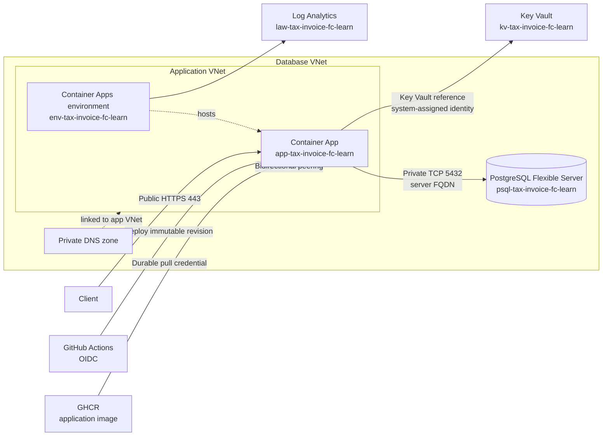

# How to deploy and verify the current Azure learning stack

> **Current source of truth — current as of 2026-08-25**
>
> This runbook documents the committed Azure topology, GitHub Actions flow,
> migration behavior, API checks, and known limitations. Use it instead of the
> legacy Bicep and setup documents. It is documentation only: it does not change
> application source, tests, infrastructure code, migrations, Postman JSON, or
> secrets.
>
> **Security:** Use placeholders in notes and commands. Never record a password,
> PAT, secret value, private request identifier, private IP address, or complete
> `DATABASE_URL` in this repository, a command, a log, a screenshot, or a commit.

For historical context only, see the [Azure deployment saga](../history/DEPLOYMENT-SAGA.md).
This runbook remains authoritative for current operations.

## Contents

- [Current topology](#current-topology)
- [Prerequisites and identities](#prerequisites-and-identities)
- [One-time Azure configuration](#one-time-azure-configuration)
- [Current GitHub Actions deployment](#current-github-actions-deployment)
- [Migration behavior](#migration-behavior)
- [API and Postman verification](#api-and-postman-verification)
- [QA evidence and limitations](#qa-evidence-and-limitations)
- [Troubleshooting](#troubleshooting)
- [Legacy and historical documents](#legacy-and-historical-documents)
- [References](#references)

## Current topology

The current learning deployment runs in **Brazil South**. The API has public
HTTPS ingress through Azure Container Apps. PostgreSQL traffic remains private:
the application and database use separate VNets connected by bidirectional
peering, and the PostgreSQL private DNS zone is linked to the application VNet.
The app uses the PostgreSQL server FQDN; it does not use a PostgreSQL Private
Endpoint for this topology.



| Resource                   | Current value                                                   |
| -------------------------- | --------------------------------------------------------------- |
| Resource group             | `rg-tax-invoice-fc-learn`                                       |
| Region                     | Brazil South                                                    |
| Container Apps environment | `env-tax-invoice-fc-learn`                                      |
| Container App              | `app-tax-invoice-fc-learn`                                      |
| PostgreSQL Flexible Server | `psql-tax-invoice-fc-learn`                                     |
| Key Vault                  | `kv-tax-invoice-fc-learn`                                       |
| Log Analytics              | `law-tax-invoice-fc-learn`                                      |
| GHCR image                 | `ghcr.io/samuel-ricardo/tax-invoice-issuer-fc`                  |
| Application VNet/subnet    | `vnet-tax-invoice-fc` / `default`                               |
| Database VNet/subnet       | `rg-tax-invoice-fc-learn-vnet` / `default`                      |
| PostgreSQL FQDN            | `psql-tax-invoice-fc-learn.postgres.database.azure.com`         |
| Private DNS zone           | `psql-tax-invoice-fc-learn.private.postgres.database.azure.com` |
| VNet peerings              | `peer-to-db-vnet` and `peer-to-app-vnet`                        |
| DNS VNet link              | `link-app-vnet`, auto-registration disabled                     |

The Container App exposes external HTTPS on port `443` and routes to target port
`3000`. The Application Url is dynamic. Copy it from the Container App
**Overview** page before each test and store it temporarily as
`<POSTMAN_BASE_URL>` or `<CURRENT_APP_FQDN>`. Do not append `:3000`.

The application requires one complete `DATABASE_URL` value. Store it as the
Key Vault secret `database-url`, expose it through the Container Apps secret
`kv-database-url`, and map the container variable `DATABASE_URL` to that secret.
Do not print or document the value. Separate database variables do not assemble
this URL.

## Prerequisites and identities

Before deploying, confirm that you have:

- Azure permissions to inspect the resource group and its RBAC assignments;
- permission to configure the GitHub `production` environment;
- an existing **Manual** Azure Container Apps migration Job named by the
  repository variable `AZURE_MIGRATION_JOB_NAME`;
- private-network connectivity from that Job to PostgreSQL;
- a PostgreSQL client on an approved VNet-connected administration host when
  database verification is required; and
- an approved secret store for the database administrator credential and GHCR
  read credential.

Keep the identities and credentials separate:

| Mechanism                              | Purpose                                                | Required access                                                       |
| -------------------------------------- | ------------------------------------------------------ | --------------------------------------------------------------------- |
| GitHub OIDC deployment identity        | Logs GitHub Actions into Azure without a client secret | **Contributor** on `rg-tax-invoice-fc-learn`                          |
| Container App system-assigned identity | Reads `database-url` from Key Vault at runtime         | **Key Vault Secrets User** on `kv-tax-invoice-fc-learn`               |
| Durable GHCR credential                | Lets the app and migration Job pull private images     | `GHCR_USERNAME` plus `GHCR_READ_TOKEN`; the token has `read:packages` |

The human who creates or views Key Vault secrets needs **Key Vault Administrator**
at vault scope. Subscription **Owner** alone does not grant Key Vault secret
data-plane access. Do not use `AZURE_CREDENTIALS`; the current deployment uses
OIDC.

## One-time Azure configuration

Use these checks when creating or rebuilding the recorded learning stack. Do not
recreate the network, database, Key Vault, or RBAC for each code deployment.

1. Create or select resource group `rg-tax-invoice-fc-learn` in Brazil South.
2. Create the application VNet `vnet-tax-invoice-fc` and its `default` subnet.
3. Create the database VNet `rg-tax-invoice-fc-learn-vnet` and its `default`
   subnet. Ensure the address ranges do not overlap.
4. Create PostgreSQL Flexible Server `psql-tax-invoice-fc-learn` using private
   access/VNet integration and the database VNet. Do not add a broad public
   firewall rule or substitute a PostgreSQL Private Endpoint topology.
5. Create the private DNS zone
   `psql-tax-invoice-fc-learn.private.postgres.database.azure.com` and link it
   to the application VNet with `link-app-vnet`; leave auto-registration
   disabled.
6. Create both VNet peerings and verify they show **Connected**:
   `peer-to-db-vnet` from the app VNet and `peer-to-app-vnet` in reverse.
7. Create Log Analytics workspace `law-tax-invoice-fc-learn` and use it for the
   Container Apps environment.
8. Create Key Vault `kv-tax-invoice-fc-learn` with Azure RBAC. Create the enabled
   secret named `database-url` with the complete value in the secure portal
   field only. Never copy that value into documentation.
9. Create environment `env-tax-invoice-fc-learn` and app
   `app-tax-invoice-fc-learn` in the app VNet. Configure external ingress,
   target port `3000`, HTTPS, minimum replicas `0`, and maximum replicas `1`.
10. Configure the app registry as `ghcr.io` with the lowercase image repository
    and the durable GHCR credential. Enable the app system-assigned identity and
    grant it **Key Vault Secrets User** on the vault.
11. Add Container Apps secret `kv-database-url` as a Key Vault reference to the
    `database-url` Secret Identifier using the system-assigned identity. Map
    `DATABASE_URL` to `kv-database-url` and create a new revision when prompted.
12. Confirm that the existing migration Job has `DATABASE_URL` configured,
    private access to PostgreSQL, and a valid GHCR registry secret reference.

### OIDC claims

The deploy job runs in GitHub environment `production`. The federated credential
must match these claims exactly:

| Claim    | Value                                                              |
| -------- | ------------------------------------------------------------------ |
| Subject  | `repo:Samuel-Ricardo/Tax-Invoice-Issuer-FC:environment:production` |
| Issuer   | `https://token.actions.githubusercontent.com`                      |
| Audience | `api://AzureADTokenExchange`                                       |

The GitHub `production` environment contains these secret **names** (not values):

- `AZURE_CLIENT_ID`
- `AZURE_TENANT_ID`
- `AZURE_SUBSCRIPTION_ID`
- `GHCR_USERNAME`
- `GHCR_READ_TOKEN`

The repository variable `AZURE_MIGRATION_JOB_NAME` identifies the existing
migration Job. Never document its value if it reveals a private request or
internal identifier; use `<AZURE_MIGRATION_JOB_NAME>` in general notes.

## Current GitHub Actions deployment

The committed workflow is `.github/workflows/docker-publish.yaml`. A push to
`main` follows this sequence:

```text
build application image and migration image
  -> publish and validate immutable digests
  -> Azure OIDC login
  -> validate existing migration Job and durable GHCR credentials
  -> update and start migration Job
  -> wait for migration success
  -> deploy application revision by digest
```

Important behavior:

- Pull requests build without deploying. A version tag publishes an image but
  does not run the deploy job.
- The build authenticates to GHCR with the run-scoped `GITHUB_TOKEN` only for
  publication.
- The application and migration images are published with SHA/digest outputs;
  deployment uses immutable `sha256:<digest>` references, not a mutable tag.
- The deploy job uses Azure OIDC with the three `AZURE_*` secrets above.
- The deploy and migration Job pull configuration uses durable
  `GHCR_USERNAME` and `GHCR_READ_TOKEN`.
- The migration gate must succeed before the application deploy step runs. If
  the Job fails, is missing, lacks `DATABASE_URL`, or cannot pull its image, the
  application rollout is blocked.

The application deploy target is:

```yaml
resourceGroup: rg-tax-invoice-fc-learn
containerAppName: app-tax-invoice-fc-learn
containerAppEnvironment: env-tax-invoice-fc-learn
imageToDeploy: ghcr.io/samuel-ricardo/tax-invoice-issuer-fc@sha256:<APPLICATION_DIGEST>
registryUrl: ghcr.io
registryUsername: ${{ secrets.GHCR_USERNAME }}
registryPassword: ${{ secrets.GHCR_READ_TOKEN }}
```

A green Actions run proves the build, migration gate, and Azure update completed.
It does not by itself prove image pull after restart, Key Vault resolution,
private database connectivity, or public HTTP behavior.

## Migration behavior

### What the deployment executes

The migration Job executes **only** `migration/create.sql`:

- `Dockerfile.migrations` copies that file to `/migration/create.sql`;
- `migration/runner.sh` validates `DATABASE_URL` and runs `psql` with
  `--single-transaction` and `ON_ERROR_STOP=1`; and
- the workflow updates and starts the existing Job with the immutable migration
  image digest.

`migration/versions/` is retained repository content, but it is **not executed**
by the current ACA Job and must not be described as the current deployment
migration path.

### Intentional reset and seed

`migration/create.sql` intentionally performs the following in one transaction:

1. `DROP SCHEMA sam CASCADE` when it exists;
2. creates the `uuid-ossp` extension when needed;
3. recreates schema `sam` and its current tables; and
4. seeds the 2022 contract/payment fixture used by the invoice strategies.

This reset is intentional. **Every deployment that passes the migration gate
resets and reseeds the database.** Do not treat this Job as an additive,
version-tracked migration system, and do not expect data to persist across a
successful deployment.

### PostgreSQL prerequisites

Before the first run, the database administrator must verify:

- the Job's database principal can connect to `<DATABASE_NAME>` and has
  `CONNECT` there;
- the principal can create the `sam` schema and create the tables and foreign
  key in that database;
- the principal owns the `sam` schema it creates, or has the authority required
  to drop `sam` on every later reset; and
- the PostgreSQL Flexible Server allowlist includes `uuid-ossp` in the
  `azure.extensions` server parameter, while preserving any existing entries.

The `CREATE EXTENSION "uuid-ossp"` statement still requires the server/database
permissions Azure permits for that extension. If the migration fails at the
extension or schema step, have the database administrator verify the allowlist,
`CONNECT`, `CREATE`, and schema ownership/administrative privileges. Do not work
around the gate by running `migration/versions/`.

## API and Postman verification

### Smoke test

Copy the current Application Url into `<POSTMAN_BASE_URL>` and test:

```bash
curl -i "<POSTMAN_BASE_URL>/"
```

Expected result: HTTP `200` with a JSON object equivalent to:

```json
{ "hello": "world" }
```

`GET /` is the current smoke test. The app has no `/health`, `/swagger`,
`/api-docs`, or live `/swagger.json` route.

### Invoice request

`POST /invoice` accepts JSON with these fields:

| Field    | Type   | Required | Values or behavior                                                                    |
| -------- | ------ | -------- | ------------------------------------------------------------------------------------- |
| `month`  | number | Yes      | Requested month                                                                       |
| `year`   | number | Yes      | Requested year                                                                        |
| `type`   | string | Yes      | `cash` or `accrual`                                                                   |
| `format` | string | No       | Accepted intentionally as a no-op; `pdf` does not require or imply PDF implementation |

Example request:

```bash
curl -i -X POST "<POSTMAN_BASE_URL>/invoice" \
  -H "Content-Type: application/json" \
  -d '{"month":1,"year":2024,"type":"cash"}'
```

A successful response is a structured JSON array, serialized once. It is not an
escaped JSON string:

```json
[
  {
    "date": "<ISO_DATE>",
    "amount": 6000
  }
]
```

The final runtime Postman check must parse the body and assert that the parsed
value is an **array**, not a string. This behavior is covered by commits
`f1b551c` and `1927d73`.

The current fixture is dated 2022. Therefore, `cash` with a 2024 date returning
`[]` is inconclusive: it can simply mean that no seeded payment matches that
month/year. Runtime observation of the accrual path returned three invoices from
the 2022 fixture. Record the request date and result when reporting a check.

## QA evidence and limitations

The current deployment evidence records:

- GitHub Actions completed successfully;
- deployment and migration completion were verified from Azure logs; and
- application-to-PostgreSQL connectivity was verified from logs, including the
  PostgreSQL connection message.

These results do not constitute a passing end-to-end suite. The local E2E run was
blocked when the local `DATABASE_URL` was missing; do not claim that the E2E suite
passed. Postman runtime verification is a separate boundary check and must use
the parsed-array assertion described above.

Known application limitation: some error paths can return HTTP `200` while the
body reports `status: 500`. Validation failures are expected to use HTTP `400`,
but do not infer every runtime error status from the body. This is an application
response-contract limitation, not an Azure networking result.

## Troubleshooting

### DNS or private database endpoint

If the app starts but `POST /invoice` cannot connect:

1. Confirm PostgreSQL is **Ready**.
2. Confirm both VNet peerings show **Connected**.
3. Confirm the private DNS zone is
   `psql-tax-invoice-fc-learn.private.postgres.database.azure.com`.
4. Confirm `link-app-vnet` links that zone to `vnet-tax-invoice-fc` with
   auto-registration disabled.
5. From an approved VNet-connected host, run only a DNS check:

   ```bash
   nslookup psql-tax-invoice-fc-learn.postgres.database.azure.com
   ```

6. Confirm the Job and app use the server FQDN and private route. Do not publish
   the resolved private address.

### Key Vault reference

For `SecretError: DATABASE_URL is required` or a Key Vault resolution failure,
check metadata only:

- `database-url` exists and is enabled in `kv-tax-invoice-fc-learn`;
- the app system-assigned identity has **Key Vault Secrets User**;
- `kv-database-url` uses the current Secret Identifier and system identity;
- `DATABASE_URL` maps to `kv-database-url`; and
- after a secret or identity change, save the configuration and create a new
  revision or restart the app.

Never print the secret value or a complete connection URL.

### GHCR pull credentials

If a restart or scale-from-zero produces `ImagePullUnauthorized`, `401`, or
`403`, verify that the app and migration Job use `GHCR_USERNAME` and the durable
`GHCR_READ_TOKEN`. `GITHUB_TOKEN` is scoped to the workflow run and is not a
runtime pull credential.

### Migration Job logs

If the workflow blocks at the migration gate:

1. Open the configured Job named by `<AZURE_MIGRATION_JOB_NAME>` in the current
   resource group.
2. Inspect the execution status and logs.
3. Check `DATABASE_URL` presence without revealing its value.
4. Check the Job's GHCR registry secret reference and private VNet route.
5. Check the `uuid-ossp` allowlist and database privileges.
6. Confirm the failing file is `migration/create.sql`; the current workflow does
   not execute `migration/versions/`.

### Schema verification

From an approved, private administration path, verify metadata with queries such
as the following. Do not include credentials in the command or output:

```sql
SELECT schema_name
FROM information_schema.schemata
WHERE schema_name = 'sam';

SELECT table_schema, table_name
FROM information_schema.tables
WHERE table_schema = 'sam'
ORDER BY table_name;
```

After a successful deployment, the `sam` schema and current tables should exist,
and the 2022 fixture should be present. Remember that the next successful
migration execution resets them again.

### Postman expectations

- Replace `baseUrl` with `<POSTMAN_BASE_URL>` from the current Container App
  Overview; do not use a stale value from the environment JSON.
- Send `GET {{baseUrl}}/` first and require HTTP `200`.
- For `POST /invoice`, assert that `pm.response.json()` is an array, including
  when the array is empty.
- Treat `cash` plus a 2024 date returning `[]` as inconclusive against the 2022
  seed; use a date aligned with the fixture when validating returned data.
- `format: "pdf"` is accepted and intentionally does nothing. Do not expect a
  PDF file or content type.

## Legacy and historical documents

Use the [Azure overview](../README.md), [documentation index](../../../INDEX.md),
and [Postman guide](../../../../postman/README.md) for current navigation.

The following content is retained for audit or historical context only:

- `docs/deploy/azure/SETUP-GUIDE.md` — legacy/default Bicep setup; not the current
  runbook;
- `docs/deploy/azure/ARCHITECTURE.md` and `COST-ANALYSIS.md` — historical
  topology/cost assumptions; not current deployment instructions;
- `infra_public/` — legacy IaC and helper documentation; it does not provision
  the current `-learn` topology; and
- older security, analysis, ADR, and delivery reports — historical findings and
  metrics, not current deployment or QA evidence.

Old resource names such as `rg-tax-invoice-fc`, `cae-tax-invoice-fc`,
`ca-tax-invoice-fc-api`, `psql-tax-invoice-fc`, `law-tax-invoice-fc`, and
`kv-tax-invoice-fc` must not be mixed with the current `-learn` resources.

## References

### Repository evidence

- [Committed GitHub Actions workflow](../../../../.github/workflows/docker-publish.yaml)
- [Migration Dockerfile](../../../../Dockerfile.migrations)
- [Migration runner](../../../../migration/runner.sh)
- [Current reset-and-seed SQL](../../../../migration/create.sql)
- [Runtime environment contract](../../../../src/@modules/infra/config/env/env.config.ts)
- [Invoice controller](../../../../src/@modules/application/controller/invoice/invoice.controller.ts)
- [Postman guide](../../../../postman/README.md)
- [Azure deployment overview](../README.md)
- [Project README](../../../../README.md)

### Official documentation

- [Azure Container Apps custom virtual networks](https://learn.microsoft.com/en-us/azure/container-apps/custom-virtual-networks)
- [Azure Container Apps secrets and Key Vault references](https://learn.microsoft.com/en-us/azure/container-apps/manage-secrets)
- [Azure Database for PostgreSQL private access](https://learn.microsoft.com/en-us/azure/postgresql/network/concepts-networking-private)
- [Azure workload identity federation](https://learn.microsoft.com/en-us/entra/workload-id/workload-identity-federation)
- [GitHub Container Registry](https://docs.github.com/en/packages/working-with-the-container-registry)
